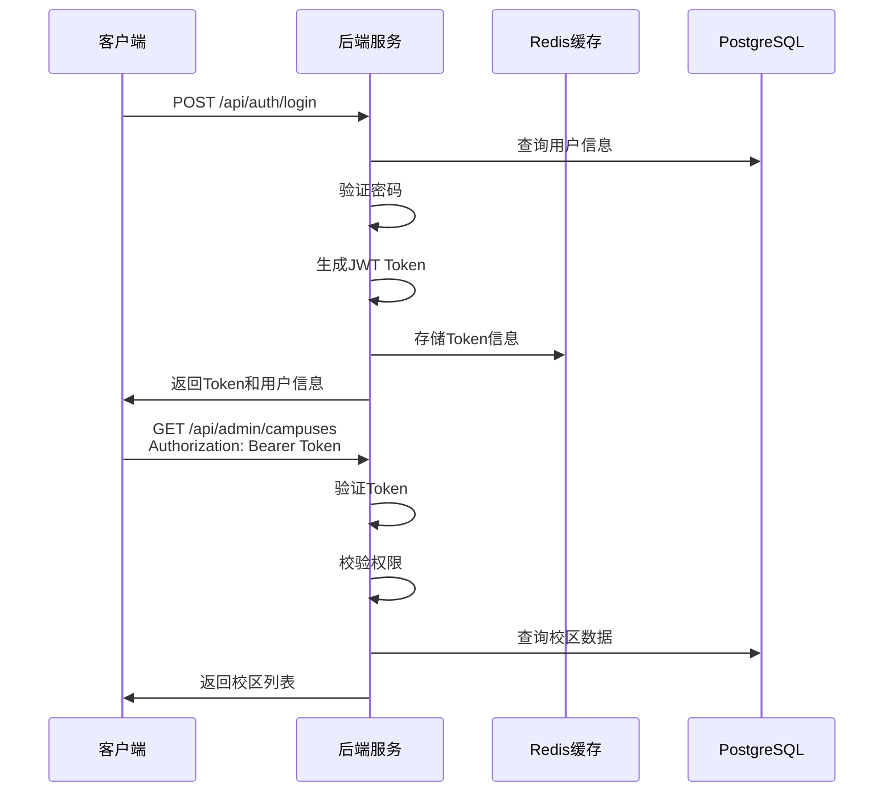
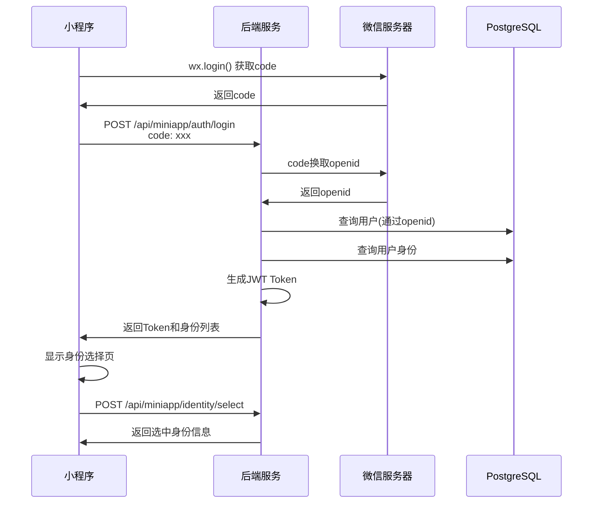

# 接口文档

> 本文档详细介绍小区英语教育管理系统的 REST API 接口规范。

## 接口概述

- **基础路径**: `http://localhost:18055`
- **认证方式**: JWT Bearer Token
- **请求格式**: JSON
- **响应格式**: JSON
- **API 文档**: Swagger UI (`/swagger-ui.html`)

---

## 通用规范

### 认证方式

除登录接口外，其他接口均需要在请求头中携带 Access Token：

```http
Authorization: Bearer <access_token>
```

### 多校区请求头

操作校区相关数据时，需要携带校区标识：

```http
X-Campus-Id: <campus_id>
```

### 统一响应格式

```json
{
  "code": 0,
  "message": "success",
  "data": { ... }
}
```

**响应字段说明**：

| 字段 | 类型 | 描述 |
|------|------|------|
| code | integer | 状态码，0 表示成功 |
| message | string | 响应消息 |
| data | object | 响应数据 |

### 分页响应格式

```json
{
  "code": 0,
  "message": "success",
  "data": {
    "total": 100,
    "pageNo": 1,
    "pageSize": 10,
    "list": [ ... ]
  }
}
```

### 分页请求参数

| 参数 | 类型 | 必填 | 描述 |
|------|------|------|------|
| pageNo | integer | 是 | 页码，从 1 开始 |
| pageSize | integer | 是 | 每页条数 |

---

## 认证接口

### 登录

**POST** `/api/auth/login`

用户账号登录，获取 JWT Token。

**请求体**：

```json
{
  "username": "admin",
  "password": "password123"
}
```

| 参数 | 类型 | 必填 | 描述 |
|------|------|------|------|
| username | string | 是 | 用户名 |
| password | string | 是 | 密码 |

**响应示例**：

```json
{
  "code": 0,
  "message": "success",
  "data": {
    "accessToken": "eyJhbGciOiJIUzI1NiIs...",
    "refreshToken": "eyJhbGciOiJIUzI1NiIs...",
    "userInfo": {
      "id": 1,
      "username": "admin",
      "realName": "管理员",
      "accountType": "ADMIN",
      "roles": ["SUPER_ADMIN"],
      "permissions": ["system:campus", "system:user", ...],
      "campusList": [
        { "id": 1, "name": "总部校区" }
      ],
      "defaultCampusId": 1
    }
  }
}
```

---

### 刷新 Token

**POST** `/api/auth/refresh`

使用 Refresh Token 获取新的 Access Token。

**请求体**：

```json
{
  "refreshToken": "eyJhbGciOiJIUzI1NiIs..."
}
```

**响应示例**：

```json
{
  "code": 0,
  "message": "success",
  "data": {
    "accessToken": "eyJhbGciOiJIUzI1NiIs...",
    "refreshToken": "eyJhbGciOiJIUzI1NiIs..."
  }
}
```

---

### 登出

**POST** `/api/auth/logout`

退出登录，清除 Token。

**请求体**（可选）：

```json
{
  "refreshToken": "eyJhbGciOiJIUzI1NiIs..."
}
```

**响应示例**：

```json
{
  "code": 0,
  "message": "success",
  "data": null
}
```

---

### 获取当前用户信息

**GET** `/api/auth/me`

获取当前登录用户的详细信息。

**响应示例**：

```json
{
  "code": 0,
  "message": "success",
  "data": {
    "id": 1,
    "username": "admin",
    "realName": "管理员",
    "phone": "13800138000",
    "email": "admin@example.com",
    "avatarUrl": null,
    "accountType": "ADMIN",
    "roles": ["SUPER_ADMIN"],
    "permissions": ["system:campus", "system:user", ...],
    "campusList": [
      { "id": 1, "name": "总部校区", "relationType": "ADMIN" }
    ],
    "defaultCampusId": 1
  }
}
```

---

## 小程序认证接口

### 微信小程序登录

**POST** `/api/miniapp/auth/login`

通过微信授权码登录小程序。

**请求体**：

```json
{
  "code": "wx_code_from_wechat"
}
```

| 参数 | 类型 | 必填 | 描述 |
|------|------|------|------|
| code | string | 是 | 微信授权码 |

**响应示例**：

```json
{
  "code": 0,
  "message": "success",
  "data": {
    "accessToken": "eyJhbGciOiJIUzI1NiIs...",
    "refreshToken": "eyJhbGciOiJIUzI1NiIs...",
    "userInfo": {
      "id": 10,
      "realName": "张老师",
      "accountType": "TEACHER"
    },
    "availableIdentities": [
      {
        "identityType": "TEACHER",
        "identityId": 5,
        "displayName": "张老师",
        "campusName": "总部校区"
      },
      {
        "identityType": "GUARDIAN",
        "identityId": 20,
        "displayName": "张爸爸",
        "campusName": "总部校区"
      }
    ],
    "selectedIdentity": {
      "identityType": "TEACHER",
      "identityId": 5,
      "displayName": "张老师"
    }
  }
}
```

---

### 获取小程序用户信息

**GET** `/api/miniapp/me`

获取小程序当前用户及身份信息。

**响应示例**：

```json
{
  "code": 0,
  "message": "success",
  "data": {
    "userInfo": { ... },
    "availableIdentities": [ ... ],
    "selectedIdentity": { ... }
  }
}
```

---

### 选择身份

**POST** `/api/miniapp/identity/select`

切换当前操作身份（老师/学生/家长）。

**请求体**：

```json
{
  "identityType": "TEACHER",
  "identityId": 5
}
```

| 参数 | 类型 | 必填 | 描述 |
|------|------|------|------|
| identityType | string | 是 | 身份类型：TEACHER/STUDENT/GUARDIAN |
| identityId | integer | 是 | 身份记录ID |

**响应示例**：

```json
{
  "code": 0,
  "message": "success",
  "data": {
    "userInfo": { ... },
    "selectedIdentity": {
      "identityType": "TEACHER",
      "identityId": 5,
      "displayName": "张老师"
    }
  }
}
```

---

## 校区管理接口

> 权限要求：`system:campus`

### 分页查询校区

**GET** `/api/admin/campuses`

**请求参数**：

| 参数 | 类型 | 必填 | 描述 |
|------|------|------|------|
| pageNo | integer | 是 | 页码 |
| pageSize | integer | 是 | 每页条数 |
| keyword | string | 否 | 搜索关键词（名称/编码） |
| status | string | 否 | 状态筛选 |

**响应示例**：

```json
{
  "code": 0,
  "message": "success",
  "data": {
    "total": 5,
    "pageNo": 1,
    "pageSize": 10,
    "list": [
      {
        "id": 1,
        "code": "HQ",
        "name": "总部校区",
        "shortName": "总部",
        "contactName": "李经理",
        "contactPhone": "13800138000",
        "address": "北京市朝阳区xxx",
        "latitude": 39.9042,
        "longitude": 116.4074,
        "businessHours": "周一至周日 9:00-21:00",
        "status": "ENABLED",
        "createdAt": "2024-01-01T00:00:00Z"
      }
    ]
  }
}
```

---

### 获取校区详情

**GET** `/api/admin/campuses/{id}`

**路径参数**：

| 参数 | 类型 | 描述 |
|------|------|------|
| id | integer | 校区ID |

---

### 创建校区

**POST** `/api/admin/campuses`

**请求体**：

```json
{
  "code": "BJ001",
  "name": "北京朝阳校区",
  "shortName": "朝阳",
  "contactName": "王经理",
  "contactPhone": "13900139000",
  "address": "北京市朝阳区xxx街道",
  "latitude": 39.92,
  "longitude": 116.43,
  "businessHours": "周一至周日 9:00-21:00"
}
```

---

### 更新校区

**PUT** `/api/admin/campuses/{id}`

**请求体**：同创建校区

---

### 变更校区状态

**PATCH** `/api/admin/campuses/{id}/status`

**请求体**：

```json
{
  "status": "DISABLED"
}
```

| 参数 | 类型 | 必填 | 描述 |
|------|------|------|------|
| status | string | 是 | 状态：ENABLED/DISABLED |

---

## 用户管理接口

> 权限要求：`system:user`

### 分页查询用户

**GET** `/api/admin/users`

**请求参数**：

| 参数 | 类型 | 必填 | 描述 |
|------|------|------|------|
| pageNo | integer | 是 | 页码 |
| pageSize | integer | 是 | 每页条数 |
| keyword | string | 否 | 搜索关键词（用户名/姓名/手机） |
| accountType | string | 否 | 账号类型筛选 |
| status | string | 否 | 状态筛选 |

**响应示例**：

```json
{
  "code": 0,
  "message": "success",
  "data": {
    "total": 50,
    "pageNo": 1,
    "pageSize": 10,
    "list": [
      {
        "id": 1,
        "username": "admin",
        "realName": "系统管理员",
        "phone": "13800138000",
        "email": "admin@example.com",
        "avatarUrl": null,
        "accountType": "ADMIN",
        "status": "ENABLED",
        "lastLoginAt": "2024-01-15T10:30:00Z",
        "roles": ["SUPER_ADMIN"]
      }
    ]
  }
}
```

---

### 获取用户详情

**GET** `/api/admin/users/{id}`

---

### 创建用户

**POST** `/api/admin/users`

**请求体**：

```json
{
  "username": "teacher01",
  "password": "password123",
  "realName": "张老师",
  "phone": "13900139001",
  "email": "teacher01@example.com",
  "accountType": "TEACHER",
  "roleIds": [2],
  "campusIds": [1]
}
```

| 参数 | 类型 | 必填 | 描述 |
|------|------|------|------|
| username | string | 是 | 用户名 |
| password | string | 是 | 初始密码 |
| realName | string | 是 | 姓名 |
| phone | string | 否 | 手机号 |
| email | string | 否 | 邮箱 |
| accountType | string | 是 | 账号类型 |
| roleIds | array | 否 | 角色ID列表 |
| campusIds | array | 否 | 可访问校区ID列表 |

---

### 更新用户

**PUT** `/api/admin/users/{id}`

---

### 重置密码

**PATCH** `/api/admin/users/{id}/password`

**请求体**：

```json
{
  "newPassword": "newPassword123"
}
```

---

### 变更用户状态

**PATCH** `/api/admin/users/{id}/status`

**请求体**：

```json
{
  "status": "DISABLED"
}
```

---

## 角色权限接口

> 权限要求：`system:role`

### 分页查询角色

**GET** `/api/admin/roles`

**请求参数**：

| 参数 | 类型 | 必填 | 描述 |
|------|------|------|------|
| pageNo | integer | 是 | 页码 |
| pageSize | integer | 是 | 每页条数 |
| keyword | string | 否 | 搜索关键词 |
| status | string | 否 | 状态筛选 |

**响应示例**：

```json
{
  "code": 0,
  "message": "success",
  "data": {
    "total": 10,
    "pageNo": 1,
    "pageSize": 10,
    "list": [
      {
        "id": 1,
        "code": "SUPER_ADMIN",
        "name": "超级管理员",
        "scopeType": "SYSTEM",
        "dataScope": "SYSTEM",
        "status": "ENABLED",
        "remark": "系统最高权限角色"
      }
    ]
  }
}
```

---

### 获取角色详情

**GET** `/api/admin/roles/{id}`

---

### 创建角色

**POST** `/api/admin/roles`

**请求体**：

```json
{
  "code": "CAMPUS_ADMIN",
  "name": "校区管理员",
  "scopeType": "CAMPUS",
  "dataScope": "CAMPUS",
  "remark": "校区运营管理员"
}
```

---

### 更新角色

**PUT** `/api/admin/roles/{id}`

---

### 角色授权

**PATCH** `/api/admin/roles/{id}/permissions`

**请求体**：

```json
{
  "permissionIds": [1, 2, 3, 5, 8]
}
```

---

### 获取权限树

**GET** `/api/admin/roles/permission-tree`

获取完整的权限树结构，用于权限配置界面。

**响应示例**：

```json
{
  "code": 0,
  "message": "success",
  "data": [
    {
      "id": 1,
      "code": "system",
      "name": "系统管理",
      "permissionType": "MENU",
      "children": [
        {
          "id": 2,
          "code": "system:campus",
          "name": "校区管理",
          "permissionType": "MENU",
          "children": []
        },
        {
          "id": 3,
          "code": "system:user",
          "name": "用户管理",
          "permissionType": "MENU",
          "children": []
        }
      ]
    },
    {
      "id": 10,
      "code": "edu",
      "name": "教务管理",
      "permissionType": "MENU",
      "children": [...]
    }
  ]
}
```

---

## 老师管理接口

> 权限要求：`edu:teacher`

### 分页查询老师

**GET** `/api/admin/teachers`

**请求参数**：

| 参数 | 类型 | 必填 | 描述 |
|------|------|------|------|
| pageNo | integer | 是 | 页码 |
| pageSize | integer | 是 | 每页条数 |
| keyword | string | 否 | 搜索关键词（姓名/工号） |
| status | string | 否 | 状态筛选 |

**响应示例**：

```json
{
  "code": 0,
  "message": "success",
  "data": {
    "total": 20,
    "pageNo": 1,
    "pageSize": 10,
    "list": [
      {
        "id": 1,
        "employeeNo": "T001",
        "name": "张老师",
        "gender": "MALE",
        "phone": "13900139001",
        "title": "高级教师",
        "specialties": ["自然拼读", "KET/PET"],
        "intro": "10年英语教学经验",
        "hireDate": "2020-01-01",
        "status": "ENABLED"
      }
    ]
  }
}
```

---

### 获取老师详情

**GET** `/api/admin/teachers/{id}`

---

### 创建老师

**POST** `/api/admin/teachers`

**请求体**：

```json
{
  "employeeNo": "T002",
  "name": "李老师",
  "gender": "FEMALE",
  "phone": "13900139002",
  "title": "中级教师",
  "specialties": ["绘本阅读", "口语表达"],
  "intro": "5年少儿英语教学经验",
  "hireDate": "2023-06-01"
}
```

---

### 更新老师

**PUT** `/api/admin/teachers/{id}`

---

### 变更老师状态

**PATCH** `/api/admin/teachers/{id}/status`

---

## 课程管理接口

> 权限要求：`edu:course`

### 分页查询课程

**GET** `/api/admin/courses`

**请求参数**：

| 参数 | 类型 | 必填 | 描述 |
|------|------|------|------|
| pageNo | integer | 是 | 页码 |
| pageSize | integer | 是 | 每页条数 |
| keyword | string | 否 | 搜索关键词 |
| courseSystem | string | 否 | 课程体系筛选 |
| status | string | 否 | 状态筛选 |

**响应示例**：

```json
{
  "code": 0,
  "message": "success",
  "data": {
    "total": 15,
    "pageNo": 1,
    "pageSize": 10,
    "list": [
      {
        "id": 1,
        "courseCode": "PHONICS-L1",
        "courseSystem": "自然拼读",
        "name": "自然拼读 Level 1",
        "levelName": "L1",
        "targetAgeMin": 4,
        "targetAgeMax": 6,
        "gradeScope": "幼儿园中班-大班",
        "totalHours": 40,
        "unitPrice": 150,
        "packagePrice": 5000,
        "description": "系统学习自然拼读规则",
        "status": "ENABLED"
      }
    ]
  }
}
```

---

### 获取课程详情

**GET** `/api/admin/courses/{id}`

---

### 创建课程

**POST** `/api/admin/courses`

**请求体**：

```json
{
  "courseCode": "KET-STARTER",
  "courseSystem": "剑桥英语",
  "name": "KET 备考基础班",
  "levelName": "Starter",
  "targetAgeMin": 8,
  "targetAgeMax": 10,
  "gradeScope": "小学3-4年级",
  "totalHours": 60,
  "unitPrice": 200,
  "packagePrice": 10000,
  "description": "KET考试基础课程"
}
```

---

### 更新课程

**PUT** `/api/admin/courses/{id}`

---

### 变更课程状态

**PATCH** `/api/admin/courses/{id}/status`

---

## 班级管理接口

> 权限要求：`edu:class`

### 分页查询班级

**GET** `/api/admin/classes`

**请求参数**：

| 参数 | 类型 | 必填 | 描述 |
|------|------|------|------|
| pageNo | integer | 是 | 页码 |
| pageSize | integer | 是 | 每页条数 |
| keyword | string | 否 | 搜索关键词 |
| courseId | integer | 否 | 课程ID筛选 |
| status | string | 否 | 状态筛选 |

**响应示例**：

```json
{
  "code": 0,
  "message": "success",
  "data": {
    "total": 30,
    "pageNo": 1,
    "pageSize": 10,
    "list": [
      {
        "id": 1,
        "classNo": "PH-L1-A",
        "name": "自然拼读L1-A班",
        "courseId": 1,
        "courseName": "自然拼读 Level 1",
        "headTeacherId": 1,
        "headTeacherName": "张老师",
        "classroom": "A教室",
        "startDate": "2024-03-01",
        "endDate": "2024-06-30",
        "maxStudents": 8,
        "currentStudents": 6,
        "status": "ONGOING"
      }
    ]
  }
}
```

---

### 获取班级详情

**GET** `/api/admin/classes/{id}`

---

### 创建班级

**POST** `/api/admin/classes`

**请求体**：

```json
{
  "courseId": 1,
  "classNo": "PH-L1-B",
  "name": "自然拼读L1-B班",
  "headTeacherId": 2,
  "classroom": "B教室",
  "startDate": "2024-04-01",
  "endDate": "2024-07-31",
  "maxStudents": 8,
  "remark": "新开班级"
}
```

---

### 更新班级

**PUT** `/api/admin/classes/{id}`

---

### 变更班级状态

**PATCH** `/api/admin/classes/{id}/status`

**状态值**：
- `PREPARING` - 准备中
- `ENROLLING` - 招生中
- `ONGOING` - 进行中
- `COMPLETED` - 已结课
- `SUSPENDED` - 已暂停

---

### 获取班级学生列表

**GET** `/api/admin/classes/{id}/students`

**响应示例**：

```json
{
  "code": 0,
  "message": "success",
  "data": [
    {
      "studentId": 1,
      "studentNo": "S001",
      "name": "小明",
      "nickname": "小明明",
      "gender": "MALE",
      "grade": "幼儿园大班",
      "joinDate": "2024-03-01",
      "status": "ACTIVE"
    }
  ]
}
```

---

## 学生管理接口

> 权限要求：`edu:student`

### 分页查询学生

**GET** `/api/admin/students`

**请求参数**：

| 参数 | 类型 | 必填 | 描述 |
|------|------|------|------|
| pageNo | integer | 是 | 页码 |
| pageSize | integer | 是 | 每页条数 |
| keyword | string | 否 | 搜索关键词（姓名/学号） |
| grade | string | 否 | 年级筛选 |
| status | string | 否 | 状态筛选 |

**响应示例**：

```json
{
  "code": 0,
  "message": "success",
  "data": {
    "total": 100,
    "pageNo": 1,
    "pageSize": 10,
    "list": [
      {
        "id": 1,
        "studentNo": "S001",
        "name": "小明",
        "nickname": "小明明",
        "avatarUrl": null,
        "gender": "MALE",
        "birthday": "2018-05-15",
        "grade": "幼儿园大班",
        "school": "朝阳幼儿园",
        "englishLevel": "零基础",
        "learningGoal": "培养英语兴趣",
        "status": "ACTIVE",
        "enrolledAt": "2024-01-01"
      }
    ]
  }
}
```

---

### 获取学生详情

**GET** `/api/admin/students/{id}`

---

### 创建学生

**POST** `/api/admin/students`

**请求体**：

```json
{
  "studentNo": "S002",
  "name": "小红",
  "nickname": "小红红",
  "gender": "FEMALE",
  "birthday": "2019-03-20",
  "grade": "幼儿园中班",
  "school": "海淀幼儿园",
  "englishLevel": "有基础",
  "learningGoal": "提升口语能力"
}
```

---

### 更新学生

**PUT** `/api/admin/students/{id}`

---

### 变更学生状态

**PATCH** `/api/admin/students/{id}/status`

---

## 接口调用流程示例

### 登录并获取数据流程



### 小程序登录流程



---

## 错误码说明

| 错误码 | 描述 |
|--------|------|
| 0 | 成功 |
| 1001 | 用户名或密码错误 |
| 1002 | Token已过期 |
| 1003 | Token无效 |
| 1004 | 权限不足 |
| 1005 | 用户已被禁用 |
| 2001 | 参数校验失败 |
| 2002 | 数据不存在 |
| 2003 | 数据已存在 |
| 3001 | 校区不存在 |
| 3002 | 无权访问该校区 |
| 5001 | 系统内部错误 |

---

## Swagger 文档

系统集成了 SpringDoc OpenAPI，可通过以下地址访问交互式 API 文档：

- **Swagger UI**: http://localhost:18055/swagger-ui.html
- **OpenAPI JSON**: http://localhost:18055/v3/api-docs