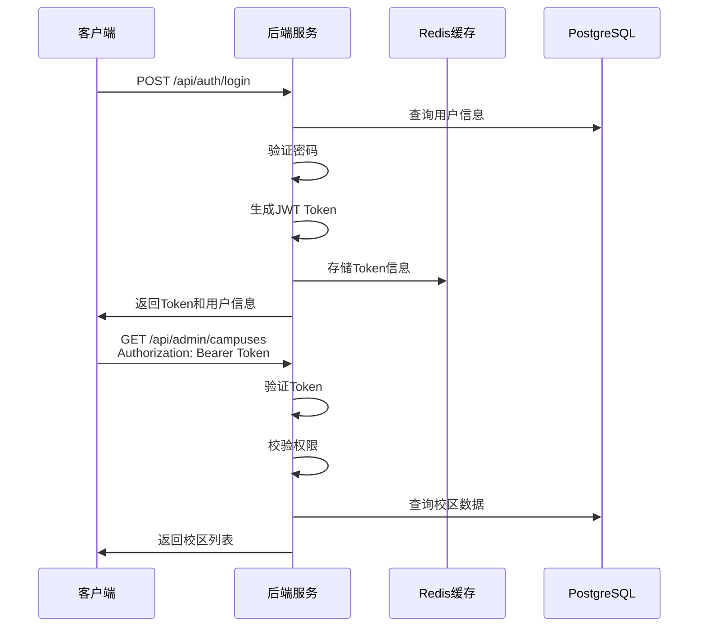
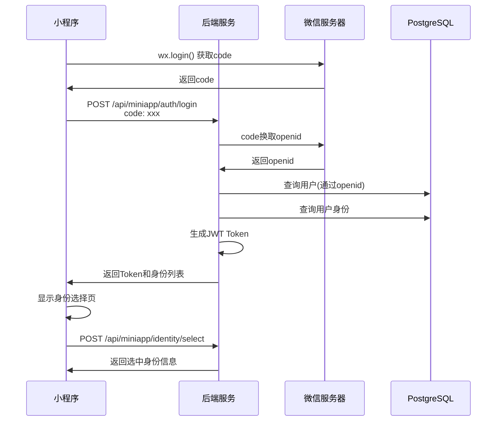
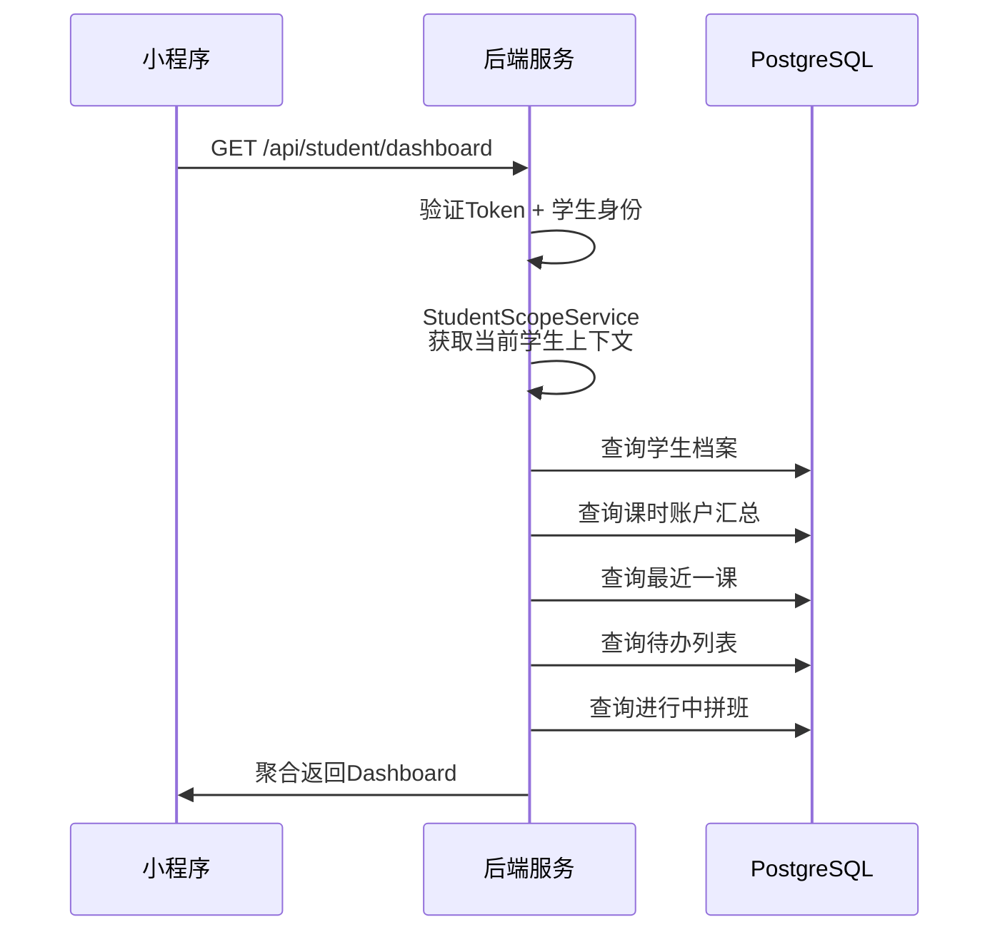
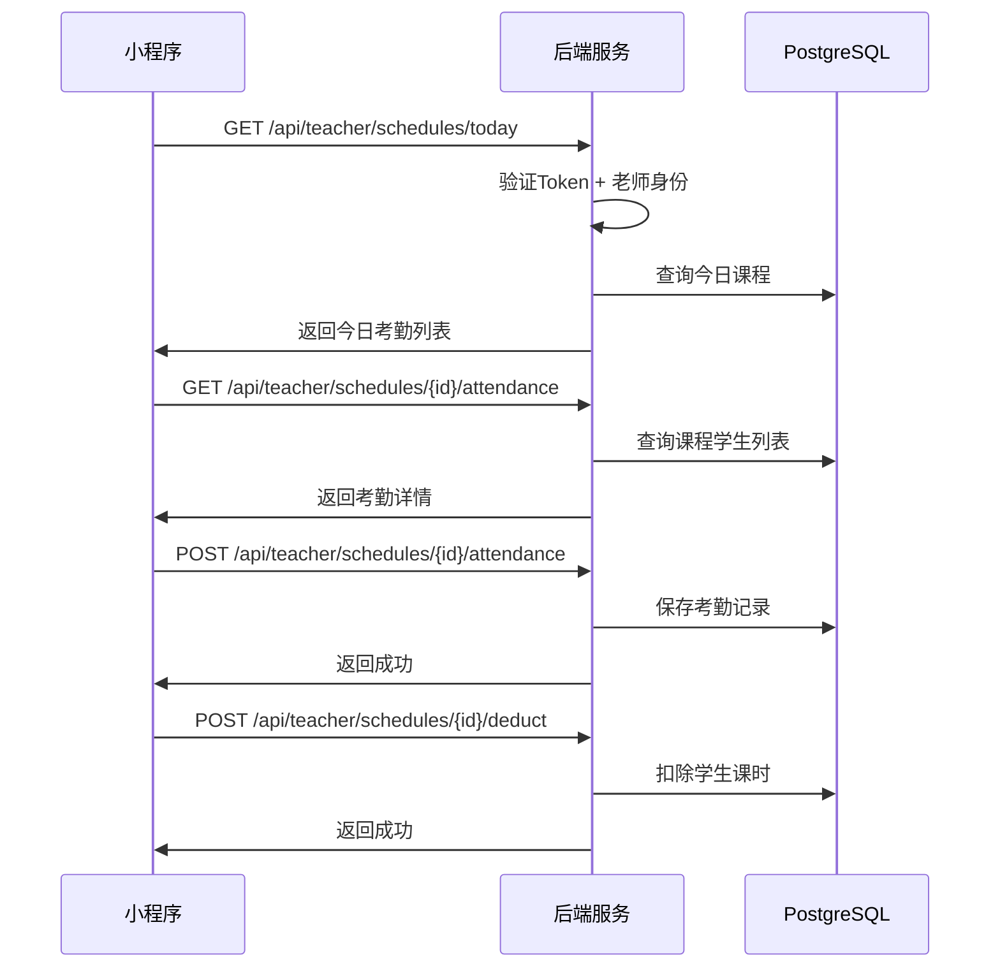

# 接口文档

> 本文档详细介绍小区英语教育管理系统的 REST API 接口规范。

## 接口概述

- **基础路径**: `http://localhost:8055`
- **认证方式**: JWT Bearer Token
- **请求格式**: JSON
- **响应格式**: JSON
- **API 文档**: Swagger UI (`/swagger-ui.html`)

---

## 通用规范

### 认证方式

除登录接口外，其他接口均需要在请求头中携带 Access Token：

```http
Authorization: Bearer <access_token>
```

### 多校区请求头

操作校区相关数据时，需要携带校区标识：

```http
X-Campus-Id: <campus_id>
```

### 统一响应格式

```json
{
  "code": 0,
  "message": "success",
  "data": { ... }
}
```

**响应字段说明**：

| 字段 | 类型 | 描述 |
|------|------|------|
| code | integer | 状态码，0 表示成功 |
| message | string | 响应消息 |
| data | object | 响应数据 |

### 分页响应格式

```json
{
  "code": 0,
  "message": "success",
  "data": {
    "total": 100,
    "pageNo": 1,
    "pageSize": 10,
    "list": [ ... ]
  }
}
```

### 分页请求参数

| 参数 | 类型 | 必填 | 描述 |
|------|------|------|------|
| pageNo | integer | 是 | 页码，从 1 开始 |
| pageSize | integer | 是 | 每页条数 |

---

## 认证接口

### 登录

**POST** `/api/auth/login`

用户账号登录，获取 JWT Token。

**请求体**：

```json
{
  "username": "admin",
  "password": "password123"
}
```

| 参数 | 类型 | 必填 | 描述 |
|------|------|------|------|
| username | string | 是 | 用户名 |
| password | string | 是 | 密码 |

**响应示例**：

```json
{
  "code": 0,
  "message": "success",
  "data": {
    "accessToken": "eyJhbGciOiJIUzI1NiIs...",
    "refreshToken": "eyJhbGciOiJIUzI1NiIs...",
    "userInfo": {
      "id": 1,
      "username": "admin",
      "realName": "管理员",
      "accountType": "ADMIN",
      "roles": ["SUPER_ADMIN"],
      "permissions": ["system:campus", "system:user", ...],
      "campusList": [
        { "id": 1, "name": "总部校区" }
      ],
      "defaultCampusId": 1
    }
  }
}
```

---

### 刷新 Token

**POST** `/api/auth/refresh`

使用 Refresh Token 获取新的 Access Token。

**请求体**：

```json
{
  "refreshToken": "eyJhbGciOiJIUzI1NiIs..."
}
```

**响应示例**：

```json
{
  "code": 0,
  "message": "success",
  "data": {
    "accessToken": "eyJhbGciOiJIUzI1NiIs...",
    "refreshToken": "eyJhbGciOiJIUzI1NiIs..."
  }
}
```

---

### 登出

**POST** `/api/auth/logout`

退出登录，清除 Token。

**请求体**（可选）：

```json
{
  "refreshToken": "eyJhbGciOiJIUzI1NiIs..."
}
```

**响应示例**：

```json
{
  "code": 0,
  "message": "success",
  "data": null
}
```

---

### 获取当前用户信息

**GET** `/api/auth/me`

获取当前登录用户的详细信息。

**响应示例**：

```json
{
  "code": 0,
  "message": "success",
  "data": {
    "id": 1,
    "username": "admin",
    "realName": "管理员",
    "phone": "13800138000",
    "email": "admin@example.com",
    "avatarUrl": null,
    "accountType": "ADMIN",
    "roles": ["SUPER_ADMIN"],
    "permissions": ["system:campus", "system:user", ...],
    "campusList": [
      { "id": 1, "name": "总部校区", "relationType": "ADMIN" }
    ],
    "defaultCampusId": 1
  }
}
```

---

## 小程序认证接口

### 微信小程序登录

**POST** `/api/miniapp/auth/login`

通过微信授权码登录小程序。

**请求体**：

```json
{
  "code": "wx_code_from_wechat"
}
```

| 参数 | 类型 | 必填 | 描述 |
|------|------|------|------|
| code | string | 是 | 微信授权码 |

**响应示例**：

```json
{
  "code": 0,
  "message": "success",
  "data": {
    "accessToken": "eyJhbGciOiJIUzI1NiIs...",
    "refreshToken": "eyJhbGciOiJIUzI1NiIs...",
    "userInfo": {
      "id": 10,
      "realName": "张老师",
      "accountType": "TEACHER"
    },
    "availableIdentities": [
      {
        "identityType": "TEACHER",
        "identityId": 5,
        "displayName": "张老师",
        "campusName": "总部校区"
      },
      {
        "identityType": "GUARDIAN",
        "identityId": 20,
        "displayName": "张爸爸",
        "campusName": "总部校区"
      }
    ],
    "selectedIdentity": {
      "identityType": "TEACHER",
      "identityId": 5,
      "displayName": "张老师"
    }
  }
}
```

---

### 获取小程序用户信息

**GET** `/api/miniapp/me`

获取小程序当前用户及身份信息。

**响应示例**：

```json
{
  "code": 0,
  "message": "success",
  "data": {
    "userInfo": { ... },
    "availableIdentities": [ ... ],
    "selectedIdentity": { ... }
  }
}
```

---

### 选择身份

**POST** `/api/miniapp/identity/select`

切换当前操作身份（老师/学生/家长）。

**请求体**：

```json
{
  "identityType": "TEACHER",
  "identityId": 5
}
```

| 参数 | 类型 | 必填 | 描述 |
|------|------|------|------|
| identityType | string | 是 | 身份类型：TEACHER/STUDENT/GUARDIAN |
| identityId | integer | 是 | 身份记录ID |

**响应示例**：

```json
{
  "code": 0,
  "message": "success",
  "data": {
    "userInfo": { ... },
    "selectedIdentity": {
      "identityType": "TEACHER",
      "identityId": 5,
      "displayName": "张老师"
    }
  }
}
```

---

## 校区管理接口

> 权限要求：`system:campus`

| 方法 | 路径 | 描述 |
|------|------|------|
| GET | `/api/admin/campuses` | 分页查询校区 |
| GET | `/api/admin/campuses/{id}` | 获取校区详情 |
| POST | `/api/admin/campuses` | 创建校区 |
| PUT | `/api/admin/campuses/{id}` | 更新校区 |
| PATCH | `/api/admin/campuses/{id}/status` | 变更校区状态 |

**请求参数**（分页查询）：

| 参数 | 类型 | 必填 | 描述 |
|------|------|------|------|
| pageNo | integer | 是 | 页码 |
| pageSize | integer | 是 | 每页条数 |
| keyword | string | 否 | 搜索关键词（名称/编码） |
| status | string | 否 | 状态筛选 |

---

## 用户管理接口

> 权限要求：`system:user`

| 方法 | 路径 | 描述 |
|------|------|------|
| GET | `/api/admin/users` | 分页查询用户 |
| GET | `/api/admin/users/{id}` | 获取用户详情 |
| POST | `/api/admin/users` | 创建用户 |
| PUT | `/api/admin/users/{id}` | 更新用户 |
| PATCH | `/api/admin/users/{id}/password` | 重置密码 |
| PATCH | `/api/admin/users/{id}/status` | 变更用户状态 |

**请求参数**（分页查询）：

| 参数 | 类型 | 必填 | 描述 |
|------|------|------|------|
| pageNo | integer | 是 | 页码 |
| pageSize | integer | 是 | 每页条数 |
| keyword | string | 否 | 搜索关键词（用户名/姓名/手机） |
| accountType | string | 否 | 账号类型筛选 |
| status | string | 否 | 状态筛选 |

**创建用户请求体**：

```json
{
  "username": "teacher01",
  "password": "password123",
  "realName": "张老师",
  "phone": "13900139001",
  "email": "teacher01@example.com",
  "accountType": "TEACHER",
  "roleIds": [2],
  "campusIds": [1]
}
```

---

## 角色权限接口

> 权限要求：`system:role`

| 方法 | 路径 | 描述 |
|------|------|------|
| GET | `/api/admin/roles` | 分页查询角色 |
| GET | `/api/admin/roles/{id}` | 获取角色详情 |
| POST | `/api/admin/roles` | 创建角色 |
| PUT | `/api/admin/roles/{id}` | 更新角色 |
| PATCH | `/api/admin/roles/{id}/permissions` | 角色授权 |
| GET | `/api/admin/roles/permission-tree` | 获取权限树 |

**角色授权请求体**：

```json
{
  "permissionIds": [1, 2, 3, 5, 8]
}
```

**权限树响应示例**：

```json
{
  "code": 0,
  "message": "success",
  "data": [
    {
      "id": 1,
      "code": "system",
      "name": "系统管理",
      "permissionType": "MENU",
      "children": [
        {
          "id": 2,
          "code": "system:campus",
          "name": "校区管理",
          "permissionType": "MENU",
          "children": []
        },
        {
          "id": 3,
          "code": "system:user",
          "name": "用户管理",
          "permissionType": "MENU",
          "children": []
        }
      ]
    },
    {
      "id": 10,
      "code": "edu",
      "name": "教务管理",
      "permissionType": "MENU",
      "children": [...]
    }
  ]
}
```

---

## 老师管理接口

> 权限要求：`edu:teacher`

| 方法 | 路径 | 描述 |
|------|------|------|
| GET | `/api/admin/teachers` | 分页查询老师 |
| GET | `/api/admin/teachers/{id}` | 获取老师详情 |
| POST | `/api/admin/teachers` | 创建老师 |
| PUT | `/api/admin/teachers/{id}` | 更新老师 |
| PATCH | `/api/admin/teachers/{id}/status` | 变更老师状态 |

**请求参数**（分页查询）：

| 参数 | 类型 | 必填 | 描述 |
|------|------|------|------|
| pageNo | integer | 是 | 页码 |
| pageSize | integer | 是 | 每页条数 |
| keyword | string | 否 | 搜索关键词（姓名/工号） |
| status | string | 否 | 状态筛选 |

---

## 课程管理接口

> 权限要求：`edu:course`

| 方法 | 路径 | 描述 |
|------|------|------|
| GET | `/api/admin/courses` | 分页查询课程 |
| GET | `/api/admin/courses/{id}` | 获取课程详情 |
| POST | `/api/admin/courses` | 创建课程 |
| PUT | `/api/admin/courses/{id}` | 更新课程 |
| PATCH | `/api/admin/courses/{id}/status` | 变更课程状态 |

**请求参数**（分页查询）：

| 参数 | 类型 | 必填 | 描述 |
|------|------|------|------|
| pageNo | integer | 是 | 页码 |
| pageSize | integer | 是 | 每页条数 |
| keyword | string | 否 | 搜索关键词 |
| courseSystem | string | 否 | 课程体系筛选 |
| status | string | 否 | 状态筛选 |

---

## 班级管理接口

> 权限要求：`edu:class`

| 方法 | 路径 | 描述 |
|------|------|------|
| GET | `/api/admin/classes` | 分页查询班级 |
| GET | `/api/admin/classes/{id}` | 获取班级详情 |
| POST | `/api/admin/classes` | 创建班级 |
| PUT | `/api/admin/classes/{id}` | 更新班级 |
| PATCH | `/api/admin/classes/{id}/status` | 变更班级状态 |
| GET | `/api/admin/classes/{id}/students` | 获取班级学生列表 |
| POST | `/api/admin/classes/{id}/students` | 添加班级学生 |
| DELETE | `/api/admin/classes/{id}/students/{studentId}` | 移除班级学生 |

**班级状态值**：
- `PREPARING` - 准备中
- `ENROLLING` - 招生中
- `ONGOING` - 进行中
- `COMPLETED` - 已结课
- `SUSPENDED` - 已暂停

---

## 学生管理接口

> 权限要求：`edu:student`

| 方法 | 路径 | 描述 |
|------|------|------|
| GET | `/api/admin/students` | 分页查询学生 |
| GET | `/api/admin/students/{id}` | 获取学生详情 |
| POST | `/api/admin/students` | 创建学生 |
| PUT | `/api/admin/students/{id}` | 更新学生 |
| PATCH | `/api/admin/students/{id}/status` | 变更学生状态 |

---

## 资料库接口

> 权限要求：`resource:material`

| 方法 | 路径 | 描述 |
|------|------|------|
| POST | `/api/admin/files/local` | 本地上传文件 |
| GET | `/api/admin/material-categories` | 获取资料分类列表 |
| POST | `/api/admin/material-categories` | 创建资料分类 |
| PUT | `/api/admin/material-categories/{id}` | 更新资料分类 |
| GET | `/api/admin/materials` | 分页查询资料 |
| GET | `/api/admin/materials/{id}` | 获取资料详情 |
| POST | `/api/admin/materials` | 发布资料 |
| PUT | `/api/admin/materials/{id}` | 更新资料 |
| PATCH | `/api/admin/materials/{id}/status` | 变更资料状态 |

---

## 活动管理接口

> 权限要求：`operation:activity`

| 方法 | 路径 | 描述 |
|------|------|------|
| GET | `/api/admin/activities` | 分页查询活动 |
| GET | `/api/admin/activities/{id}` | 获取活动详情 |
| POST | `/api/admin/activities` | 创建活动 |
| PUT | `/api/admin/activities/{id}` | 更新活动 |
| PATCH | `/api/admin/activities/{id}/status` | 变更活动状态 |
| GET | `/api/admin/activity-registrations` | 查询报名列表 |

---

## 拼班管理接口

> 权限要求：`operation:group`

| 方法 | 路径 | 描述 |
|------|------|------|
| GET | `/api/admin/group-requests` | 查询拼班列表 |
| POST | `/api/admin/group-requests/{id}/trial` | 安排试听 |
| POST | `/api/admin/group-trials/{trialId}/feedback` | 试听反馈 |

---

## 财务管理接口

> 权限要求：`finance:order` / `finance:payment`

| 方法 | 路径 | 描述 |
|------|------|------|
| GET | `/api/admin/orders` | 分页查询订单 |
| GET | `/api/admin/payments` | 分页查询支付记录 |

---

## 通知管理接口

> 权限要求：`system:notification`

| 方法 | 路径 | 描述 |
|------|------|------|
| GET | `/api/admin/notifications` | 分页查询通知 |
| POST | `/api/admin/notifications` | 发布通知 |

---

## 学生端接口

> 认证要求：JWT Bearer Token（学生/家长身份）
> 数据隔离：按当前选中的学生自动过滤数据

### 学生仪表盘

**GET** `/api/student/dashboard`

聚合接口，一次返回首页所需全部数据。

**响应示例**：

```json
{
  "code": 0,
  "message": "success",
  "data": {
    "profile": {
      "studentId": 1,
      "campusId": 1,
      "name": "小明",
      "nickname": "小明明",
      "grade": "幼儿园大班",
      "school": "朝阳幼儿园",
      "campusName": "总部校区",
      "campusShortName": "总部",
      "classNames": "自然拼读L1-A班"
    },
    "children": [
      {
        "studentId": 1,
        "name": "小明",
        "grade": "幼儿园大班",
        "relation": "爸爸"
      }
    ],
    "currentStudentId": 1,
    "lessonSummary": {
      "totalRemainingHours": 32.5,
      "lowBalance": false
    },
    "nextLesson": {
      "id": 10,
      "topic": "字母组合发音复习",
      "lessonDate": "2024-06-03",
      "startTime": "09:00:00",
      "endTime": "10:30:00",
      "teacherName": "张老师",
      "classroom": "A教室"
    },
    "todos": [
      {
        "bizType": "HOMEWORK_TO_SUBMIT",
        "bizId": 5,
        "title": "短元音练习",
        "content": "截止今晚 21:00"
      }
    ],
    "activeGroupRequest": {
      "id": 1,
      "targetSystem": "剑桥KET",
      "currentMembers": 3,
      "requiredMembers": 4,
      "status": "FORMING"
    }
  }
}
```

---

### 作业接口

| 方法 | 路径 | 描述 |
|------|------|------|
| GET | `/api/student/homeworks` | 作业列表 |
| GET | `/api/student/homeworks/{id}` | 作业详情 |
| POST | `/api/student/homeworks/{id}/submit` | 提交作业 |

**提交作业请求体**：

```json
{
  "content": "老师您好，这是朗读录音",
  "files": [
    {
      "fileId": 201,
      "mediaType": "AUDIO",
      "sortOrder": 1
    }
  ]
}
```

| 参数 | 类型 | 必填 | 描述 |
|------|------|------|------|
| content | string | 否 | 文字内容 |
| files | array | 否 | 附件列表 |
| files[].fileId | integer | 是 | 文件ID |
| files[].mediaType | string | 是 | 媒体类型：IMAGE/AUDIO/VIDEO |
| files[].sortOrder | integer | 否 | 排序 |

---

### 课程表接口

| 方法 | 路径 | 描述 |
|------|------|------|
| GET | `/api/student/schedules` | 课程表 |
| GET | `/api/student/lesson-hour-accounts` | 课时账户 |
| GET | `/api/student/lesson-hour-records` | 课时流水 |

**课程表请求参数**：

| 参数 | 类型 | 必填 | 描述 |
|------|------|------|------|
| startDate | string | 否 | 开始日期（ISO格式） |
| endDate | string | 否 | 结束日期（ISO格式） |

---

### 拼班接口

| 方法 | 路径 | 描述 |
|------|------|------|
| GET | `/api/student/group-requests` | 我的拼班列表 |
| POST | `/api/student/group-requests` | 发起拼班 |
| GET | `/api/student/group-requests/{id}` | 拼班详情 |
| GET | `/api/student/group-requests/by-share-code/{shareCode}` | 通过分享码获取拼班 |
| POST | `/api/student/group-requests/{id}/join` | 加入拼班 |
| POST | `/api/student/group-requests/{id}/poster` | 生成拼班海报 |

**发起拼班请求体**：

```json
{
  "childAge": 8.5,
  "grade": "三年级",
  "targetSystem": "剑桥KET体系",
  "englishLevel": "校内同步",
  "preferredTimes": ["周六上午", "周日下午"],
  "remark": "希望9月开学前开始",
  "contactPhone": "13800138000"
}
```

| 参数 | 类型 | 必填 | 描述 |
|------|------|------|------|
| childAge | number | 是 | 孩子年龄，支持小数 |
| grade | string | 是 | 年级 |
| targetSystem | string | 是 | 目标课程体系 |
| englishLevel | string | 是 | 英语基础 |
| preferredTimes | array | 是 | 可选上课时间 |
| remark | string | 否 | 备注 |
| contactPhone | string | 否 | 联系电话 |

---

### 活动接口

| 方法 | 路径 | 描述 |
|------|------|------|
| GET | `/api/student/activities` | 活动列表 |
| GET | `/api/student/activities/{id}` | 活动详情 |
| POST | `/api/student/activities/{id}/join` | 活动报名 |
| GET | `/api/student/registrations` | 我的报名 |

---

### 资料接口

| 方法 | 路径 | 描述 |
|------|------|------|
| GET | `/api/student/material-categories` | 资料分类 |
| GET | `/api/student/materials` | 资料列表 |
| GET | `/api/student/materials/{id}` | 资料详情 |
| GET | `/api/student/materials/{id}/preview` | 资料预览 |
| GET | `/api/student/materials/{id}/download` | 资料下载 |

---

### 订单接口

| 方法 | 路径 | 描述 |
|------|------|------|
| GET | `/api/student/orders/{id}` | 订单详情 |
| POST | `/api/student/orders/{id}/pay` | 订单支付 |

---

### 通知接口

| 方法 | 路径 | 描述 |
|------|------|------|
| GET | `/api/student/notifications` | 通知列表 |
| POST | `/api/student/notifications/{id}/read` | 标记已读 |
| POST | `/api/student/notifications/read-all` | 全部已读 |

**通知请求参数**：

| 参数 | 类型 | 必填 | 描述 |
|------|------|------|------|
| status | string | 否 | 状态筛选 |
| limit | integer | 否 | 返回条数 |

---

## 教师端接口

> 认证要求：JWT Bearer Token（老师身份）

### 教师仪表盘

**GET** `/api/teacher/dashboard`

获取老师工作台首页数据。

---

### 班级管理

| 方法 | 路径 | 描述 |
|------|------|------|
| GET | `/api/teacher/classes` | 班级列表 |
| GET | `/api/teacher/classes/{id}` | 班级详情 |
| GET | `/api/teacher/students/{id}` | 学生档案 |

---

### 作业管理

| 方法 | 路径 | 描述 |
|------|------|------|
| GET | `/api/teacher/homeworks` | 作业列表 |
| GET | `/api/teacher/homeworks/{id}` | 作业详情 |
| POST | `/api/teacher/homeworks` | 创建作业 |
| POST | `/api/teacher/homeworks/{id}/publish` | 发布作业 |
| POST | `/api/teacher/homeworks/{id}/submissions/{submissionId}/comment` | 作业点评 |

**创建作业请求体**：

```json
{
  "classId": 1,
  "title": "短元音练习",
  "content": "朗读并录音短元音单词",
  "deadline": "2024-06-03T21:00:00",
  "attachments": []
}
```

**作业点评请求体**：

```json
{
  "commentText": "发音很标准！",
  "rating": 5
}
```

---

### 考勤管理

| 方法 | 路径 | 描述 |
|------|------|------|
| GET | `/api/teacher/schedules/today` | 今日考勤列表 |
| GET | `/api/teacher/schedules/{id}/attendance` | 考勤详情 |
| POST | `/api/teacher/schedules/{id}/attendance` | 批量考勤 |
| POST | `/api/teacher/schedules/{id}/deduct` | 课时扣除 |

**批量考勤请求体**：

```json
{
  "studentAttendances": [
    {
      "studentId": 1,
      "status": "PRESENT"
    },
    {
      "studentId": 2,
      "status": "ABSENT"
    }
  ]
}
```

**课时扣除请求体**：

```json
{
  "studentDeducts": [
    {
      "studentId": 1,
      "hours": 1.5
    }
  ]
}
```

---

### 课时记录

| 方法 | 路径 | 描述 |
|------|------|------|
| GET | `/api/teacher/lesson-hour-records` | 课时记录列表 |

**请求参数**：

| 参数 | 类型 | 必填 | 描述 |
|------|------|------|------|
| limit | integer | 否 | 返回条数 |

---

## 接口调用流程示例

### 登录并获取数据流程



### 小程序登录流程



### 学生端仪表盘加载流程



### 教师端考勤流程



---

## 错误码说明

| 错误码 | 描述 |
|--------|------|
| 0 | 成功 |
| 1001 | 用户名或密码错误 |
| 1002 | Token已过期 |
| 1003 | Token无效 |
| 1004 | 权限不足 |
| 1005 | 用户已被禁用 |
| 2001 | 参数校验失败 |
| 2002 | 数据不存在 |
| 2003 | 数据已存在 |
| 3001 | 校区不存在 |
| 3002 | 无权访问该校区 |
| 5001 | 系统内部错误 |

---

## Swagger 文档

系统集成了 SpringDoc OpenAPI，可通过以下地址访问交互式 API 文档：

- **Swagger UI**: http://localhost:8055/swagger-ui.html
- **OpenAPI JSON**: http://localhost:8055/v3/api-docs
