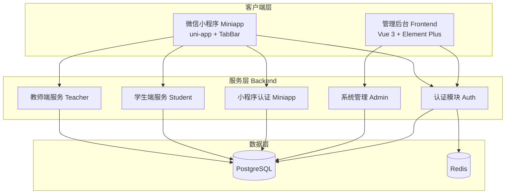
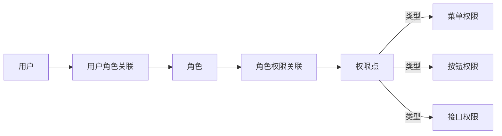
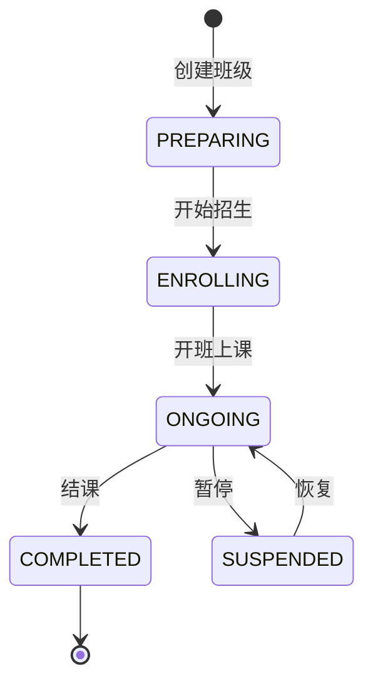
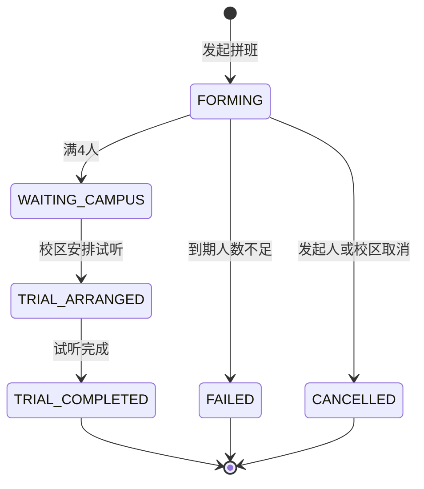
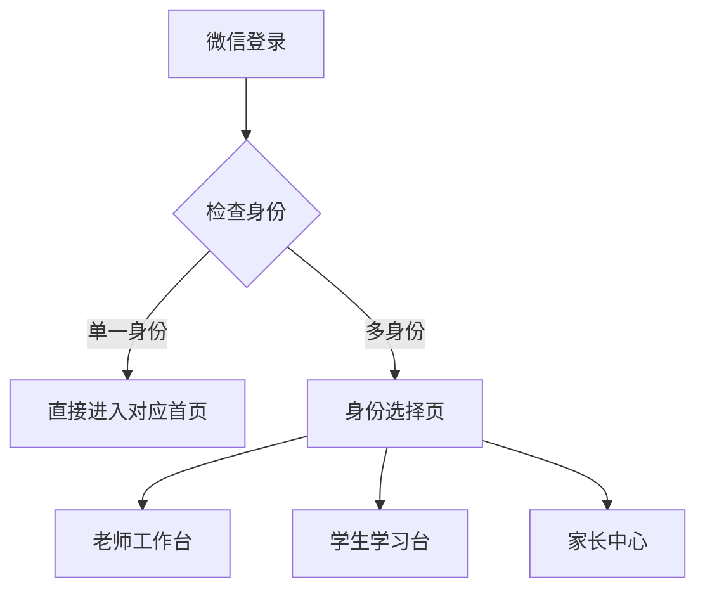
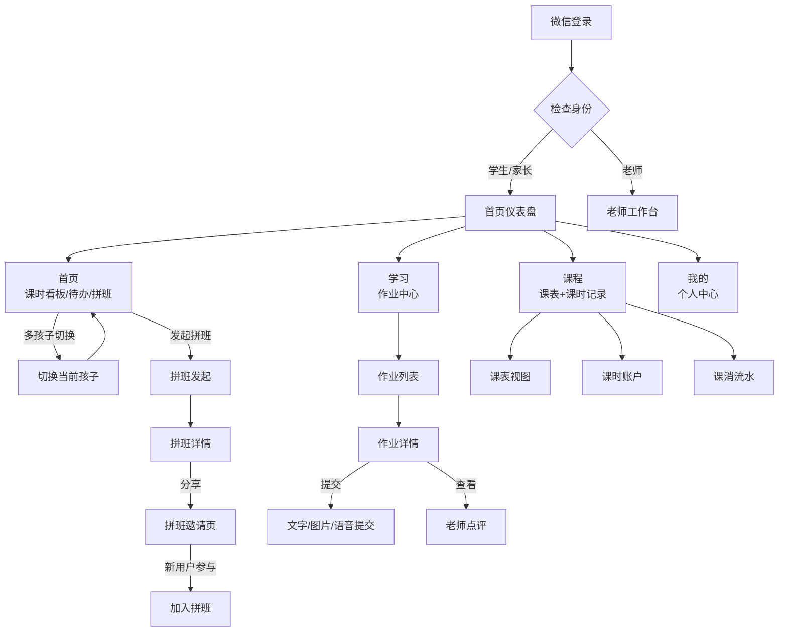
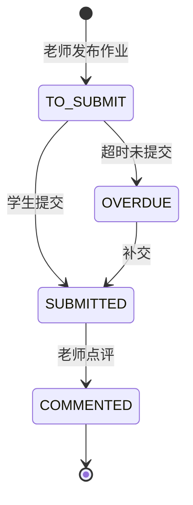
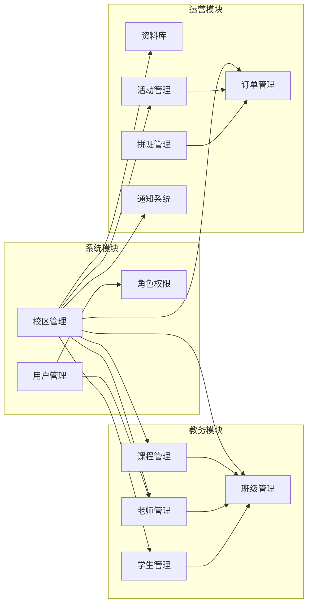
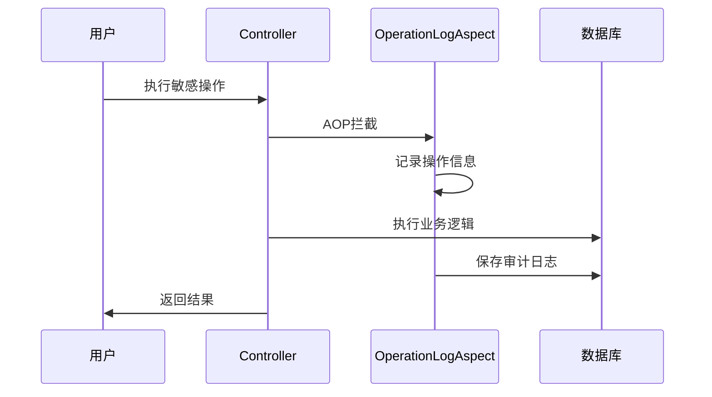

# 功能文档

> 本文档详细介绍小区英语教育管理系统的功能模块、使用场景及模块依赖关系。

## 系统概述

小区英语教育管理系统是一个面向社区英语培训机构的综合管理平台，支持多校区运营，提供教务管理、用户管理、家校互动等功能。系统采用前后端分离架构，包含三个子系统：

- **Backend** - 后端服务（Spring Boot）
- **Frontend** - 管理后台（Vue 3 + Element Plus）
- **Miniapp** - 微信小程序（uni-app）

---

## 模块架构



---

## 功能模块详解

### 一、认证授权模块

#### 1.1 用户认证

| 功能 | 描述 | 使用场景 |
|------|------|----------|
| 账号登录 | 用户名密码登录，返回 JWT Token | 管理后台登录 |
| Token 刷新 | Refresh Token 换取新 Access Token | 保持登录状态 |
| 登出 | 清除 Token，退出系统 | 用户主动退出 |
| 获取用户信息 | 获取当前登录用户详细信息 | 页面初始化、权限校验 |

#### 1.2 微信小程序认证

| 功能 | 描述 | 使用场景 |
|------|------|----------|
| 微信登录 | 通过微信 code 换取 openid 并登录 | 小程序自动登录 |
| 身份选择 | 选择当前操作身份（老师/学生/家长） | 多角色用户切换 |
| 获取个人信息 | 获取当前身份下的详细信息 | 小程序首页展示 |

#### 1.3 权限控制

系统采用 RBAC（基于角色的访问控制）模型：



**权限点类型**：
- `MENU` - 菜单权限，控制页面访问
- `BUTTON` - 按钮权限，控制操作按钮显示
- `API` - 接口权限，控制 API 调用

---

### 二、系统管理模块

#### 2.1 校区管理

| 功能 | 描述 | 使用场景 |
|------|------|----------|
| 校区列表 | 分页查询校区信息 | 校区管理页面 |
| 校区详情 | 查看单个校区详细信息 | 编辑校区前预览 |
| 创建校区 | 新增校区记录 | 开设新校区 |
| 编辑校区 | 修改校区基本信息 | 校区信息变更 |
| 状态变更 | 启用/停用校区 | 校区运营状态管理 |

**校区数据结构**：
- 校区编码、名称、简称
- 联系人、联系电话
- 地址、经纬度坐标
- 营业时间、状态

#### 2.2 用户管理

| 功能 | 描述 | 使用场景 |
|------|------|----------|
| 用户列表 | 分页查询系统用户 | 用户管理页面 |
| 用户详情 | 查看用户详细信息 | 编辑用户前预览 |
| 创建用户 | 新增系统用户账号 | 添加新员工账号 |
| 编辑用户 | 修改用户基本信息 | 用户信息变更 |
| 重置密码 | 重置用户登录密码 | 用户忘记密码 |
| 状态变更 | 启用/停用用户账号 | 账号状态管理 |

**用户类型**：
- `ADMIN` - 管理员
- `TEACHER` - 老师
- `GUARDIAN` - 家长

#### 2.3 角色权限管理

| 功能 | 描述 | 使用场景 |
|------|------|----------|
| 角色列表 | 分页查询角色 | 角色管理页面 |
| 角色详情 | 查看角色及权限配置 | 编辑角色前预览 |
| 创建角色 | 新增角色 | 定义新角色类型 |
| 编辑角色 | 修改角色基本信息 | 角色信息变更 |
| 角色授权 | 配置角色权限点 | 权限分配 |
| 权限树查询 | 获取完整权限树结构 | 权限配置界面 |

---

### 三、教务管理模块

#### 3.1 老师管理

| 功能 | 描述 | 使用场景 |
|------|------|----------|
| 老师列表 | 分页查询老师档案 | 老师管理页面 |
| 老师详情 | 查看老师详细信息 | 编辑老师前预览 |
| 创建老师 | 新增老师档案 | 新老师入职 |
| 编辑老师 | 修改老师基本信息 | 老师信息变更 |
| 状态变更 | 启用/停用老师 | 老师在职状态管理 |

**老师数据结构**：
- 工号、姓名、性别
- 职称、专长领域
- 联系电话、简介
- 入职日期、状态

#### 3.2 课程管理

| 功能 | 描述 | 使用场景 |
|------|------|----------|
| 课程列表 | 分页查询课程信息 | 课程管理页面 |
| 课程详情 | 查看课程详细信息 | 编辑课程前预览 |
| 创建课程 | 新增课程体系 | 开设新课程 |
| 编辑课程 | 修改课程基本信息 | 课程信息变更 |
| 状态变更 | 启用/停用课程 | 课程运营状态 |

**课程数据结构**：
- 课程编码、课程体系
- 课程名称、级别名称
- 适用年龄范围、年级范围
- 总课时、单价、套餐价
- 课程描述、状态

#### 3.3 班级管理

| 功能 | 描述 | 使用场景 |
|------|------|----------|
| 班级列表 | 分页查询班级信息 | 班级管理页面 |
| 班级详情 | 查看班级详细信息 | 编辑班级前预览 |
| 创建班级 | 新增班级 | 开设新班级 |
| 编辑班级 | 修改班级基本信息 | 班级信息变更 |
| 状态变更 | 变更班级状态 | 班级运营状态 |
| 班级学生 | 查询班级学生列表 | 班级学员管理 |
| 添加学生 | 向班级添加学生 | 学员分班 |
| 移除学生 | 从班级移除学生 | 学员调班 |

**班级状态流转**：



**班级数据结构**：
- 关联课程、班级编号
- 班级名称、班主任
- 教室、班级微信群二维码
- 开课日期、结课日期
- 最大人数、当前人数
- 状态、备注

#### 3.4 学生管理

| 功能 | 描述 | 使用场景 |
|------|------|----------|
| 学生列表 | 分页查询学生档案 | 学生管理页面 |
| 学生详情 | 查看学生详细信息 | 编辑学生前预览 |
| 创建学生 | 新增学生档案 | 新学员报名 |
| 编辑学生 | 修改学生基本信息 | 学生信息变更 |
| 状态变更 | 变更学生状态 | 学员状态管理 |

**学生数据结构**：
- 学号、姓名、昵称
- 头像、性别、生日
- 年级、学校
- 英语水平、学习目标
- 报名日期、状态

---

### 四、运营管理模块

#### 4.1 资料库管理

| 功能 | 描述 | 使用场景 |
|------|------|----------|
| 资料分类 | 创建/编辑资料分类 | 资料归类管理 |
| 资料列表 | 分页查询学习资料 | 资料管理页面 |
| 资料详情 | 查看资料详细信息 | 编辑资料前预览 |
| 发布资料 | 新增学习资料 | 上传教学资料 |
| 编辑资料 | 修改资料信息 | 资料信息变更 |
| 上下架 | 启用/停用资料 | 资料状态管理 |
| 文件上传 | 本地文件上传到服务器 | 资料文件上传 |

**资料数据结构**：
- 标题、分类、学习类型
- 资源类型、内容摘要
- 文件信息、下载链接
- 状态、发布时间

#### 4.2 活动管理

| 功能 | 描述 | 使用场景 |
|------|------|----------|
| 活动列表 | 分页查询校区活动 | 活动管理页面 |
| 活动详情 | 查看活动详细信息 | 编辑活动前预览 |
| 创建活动 | 发布新活动 | 校区活动发布 |
| 编辑活动 | 修改活动信息 | 活动信息变更 |
| 上下架 | 启用/停用活动 | 活动状态管理 |
| 报名管理 | 查看活动报名列表 | 报名情况统计 |

**活动数据结构**：
- 活动标题、活动类型
- 活动时间、地点
- 费用、名额限制
- 活动内容、状态

#### 4.3 拼班管理

| 功能 | 描述 | 使用场景 |
|------|------|----------|
| 拼班列表 | 查询所有拼班请求 | 拼班管理页面 |
| 安排试听 | 为满员拼班安排试听 | 校区运营跟进 |
| 试听反馈 | 记录试听反馈结果 | 试听后跟进 |

**拼班状态流转**：



#### 4.4 财务管理

| 功能 | 描述 | 使用场景 |
|------|------|----------|
| 订单列表 | 分页查询订单 | 订单管理页面 |
| 支付记录 | 分页查询支付记录 | 支付流水查看 |

**订单数据结构**：
- 订单编号、订单类型
- 关联业务、金额
- 支付状态、创建时间

#### 4.5 通知管理

| 功能 | 描述 | 使用场景 |
|------|------|----------|
| 通知列表 | 分页查询已发通知 | 通知管理页面 |
| 发布通知 | 向指定范围发送通知 | 校区通知发布 |

---

### 五、小程序功能模块

#### 5.1 身份管理

小程序支持多身份切换，一个用户可能同时具备老师、家长等多重身份：



#### 5.2 老师工作台

| 功能 | 描述 | 使用场景 |
|------|------|----------|
| 工作台看板 | 展示今日课程、待办事项 | 老师每日工作入口 |
| 班级列表 | 查看老师负责的所有班级 | 班级管理 |
| 班级详情 | 查看班级学生列表 | 班级学员管理 |
| 学生档案 | 查看单个学生详细信息 | 了解学生情况 |
| 作业列表 | 查看老师发布的所有作业 | 作业管理 |
| 发布作业 | 创建并发布班级作业 | 课后作业布置 |
| 作业详情 | 查看作业提交和点评情况 | 作业批改 |
| 发布点评 | 对学生作业进行点评 | 作业反馈 |
| 今日考勤 | 查看今日课程考勤列表 | 上课考勤 |
| 考勤详情 | 查看单次课程学生出勤情况 | 考勤记录 |
| 批量考勤 | 批量标记学生出勤状态 | 快速考勤 |
| 课时扣除 | 根据考勤扣除学生课时 | 课消管理 |
| 课时记录 | 查看老师课时消耗记录 | 课时统计 |
| 教学资料 | 查看和上传教学资料 | 资料管理 |

**老师端页面结构**：

```
pages/teacher/
├── home.vue          # 老师工作台首页
├── class/
│   ├── list.vue      # 班级列表
│   └── detail.vue    # 班级详情
├── student/
│   └── profile.vue   # 学生档案
├── homework/
│   ├── list.vue      # 作业列表
│   ├── create.vue    # 发布作业
│   └── detail.vue    # 作业详情
├── attendance/
│   ├── list.vue      # 今日考勤
│   └── detail.vue    # 考勤详情
├── checkin/
│   ├── list.vue      # 打卡任务
│   └── progress.vue  # 打卡进度
└── material/
    ├── list.vue      # 教学资料
    └── upload.vue    # 上传资料
```

#### 5.3 学生/家长端（核心业务入口）

学生端小程序采用底部 TabBar 导航（首页 → 学习 → 课程 → 我的），是集看板、作业、课表、拼班、活动于一体的核心业务入口。家长通过身份切换使用相同界面，按当前选中的孩子过滤所有数据。



##### 首页仪表盘 (`pages/student/home`)

| 功能 | 描述 | 使用场景 |
|------|------|----------|
| 课时看板 | 展示总剩余课时、低课时预警 | 家长掌握剩余课时 |
| 多孩子切换 | 支持多个孩子间切换，所有数据按孩子过滤 | 多子女家长管理 |
| 最近课程 | 展示下一节课时间、主题、老师、教室 | 课前准备提醒 |
| 待办提醒 | 作业提交、点评、拼班状态等关键待办 | 一站式行动入口 |
| 拼班入口 | 首页常驻"我要拼班"按钮 + 进行中拼班卡片 | 新老学员参与拼班 |
| 快捷入口 | 作业、课表、拼班三个快捷操作 | 高频操作快速触达 |

> 接口：`GET /api/student/dashboard`（聚合接口，一次返回 profile、课时、最近课程、待办、拼班）

##### 学习中心 (`pages/student/learning`)

| 功能 | 描述 | 使用场景 |
|------|------|----------|
| 作业列表 | 按"全部/待提交/待点评/已点评"筛选作业 | 管理所有作业 |
| 作业详情 | 查看作业要求、附件 | 课前预习、了解要求 |
| 作业提交 | 文字、图片、语音提交作业 | 课后提交 |
| 老师点评 | 查看老师的文字/语音点评和评分 | 获取学习反馈 |

**作业状态流转**：



> 接口：`GET /api/student/homeworks`，`GET /api/student/homeworks/{id}`，`POST /api/student/homeworks/{id}/submit`

##### 我的课程 (`pages/student/course`)

| 功能 | 描述 | 使用场景 |
|------|------|----------|
| 课程表 | 按日期展示排课（主题、时间、老师、教室） | 查看上课安排 |
| 课时账户 | 按课程维度展示已购/赠送/消耗/剩余课时 | 掌握课时资产 |
| 课消流水 | 购买、课消、调整、退款的完整流水 | 核对扣课明细 |

> 接口：`GET /api/student/schedules`，`GET /api/student/lesson-hour-accounts`，`GET /api/student/lesson-hour-records`

##### 拼班功能 (`pages/student/group/*`)

| 功能 | 描述 | 使用场景 |
|------|------|----------|
| 发起拼班 | 填写年龄、年级、目标体系、英语基础、可选时间 | 老学员为新课程发起拼班 |
| 拼班进度 | 实时展示已加入/所需人数、成员列表、剩余时间 | 跟踪拼班进展 |
| 邀请好友 | 转发小程序、生成邀请海报、复制链接 | 扩散获客 |
| 加入拼班 | 新用户通过分享链接填写信息参与 | 新生线索获取 |
| 查看试听 | 满4人后查看校区安排的试听时间、老师、地点 | 参与线下试听 |

> 接口：`GET/POST /api/student/group-requests`，`GET /api/student/group-requests/{id}`，`GET /api/student/group-requests/by-share-code/{shareCode}`，`POST /api/student/group-requests/{id}/join`，`POST /api/student/group-requests/{id}/poster`

##### 活动报名 (`pages/student/activity/*`)

| 功能 | 描述 | 使用场景 |
|------|------|----------|
| 活动列表 | 浏览校区发布的活动 | 查看可报名活动 |
| 活动详情 | 查看活动详细信息 | 了解活动内容 |
| 活动报名 | 报名参加活动 | 参与校区活动 |
| 我的报名 | 查看已报名活动列表 | 管理报名记录 |

> 接口：`GET /api/student/activities`，`GET /api/student/activities/{id}`，`POST /api/student/activities/{id}/join`，`GET /api/student/registrations`

##### 学习资料 (`pages/student/material/detail`)

| 功能 | 描述 | 使用场景 |
|------|------|----------|
| 资料分类 | 按分类浏览学习资料 | 查找学习资源 |
| 资料列表 | 查看所有可用资料 | 浏览资料库 |
| 资料预览 | 在线预览资料内容 | 课前预习 |
| 资料下载 | 下载资料到本地 | 离线学习 |

> 接口：`GET /api/student/material-categories`，`GET /api/student/materials`，`GET /api/student/materials/{id}/preview`，`GET /api/student/materials/{id}/download`

##### 通知中心 (`pages/mine/notifications`)

| 功能 | 描述 | 使用场景 |
|------|------|----------|
| 通知列表 | 查看收到的所有通知 | 消息查看 |
| 标记已读 | 单条或全部标记为已读 | 消息管理 |

> 接口：`GET /api/student/notifications`，`POST /api/student/notifications/{id}/read`，`POST /api/student/notifications/read-all`

#### 5.4 家长中心

| 功能 | 描述 | 使用场景 |
|------|------|----------|
| 孩子管理 | 查看关联孩子信息，支持多孩子切换 | 多子女管理 |
| 课程查看 | 查看孩子课程安排和课时余额 | 了解学习进度 |
| 作业查看 | 查看孩子作业情况和老师点评 | 监督学习 |
| 活动报名 | 报名校区活动 | 参加活动 |

> 家长与学生共用同一套 TabBar 页面（首页/学习/课程/我的），通过 `auth-flow.ts` 中的 `requireStudentAccess()` 统一鉴权，`StudentScopeService` 按当前选中的孩子自动过滤数据。

#### 5.5 认证路由守卫

小程序实现了完整的前端路由守卫 (`utils/auth-flow.ts`)：

| 守卫 | 触发条件 | 行为 |
|------|----------|------|
| `requireLogin()` | Token 缺失/过期 | 跳转登录页 |
| `requireIdentity(identityType)` | 当前身份不匹配 | 跳转对应首页 |
| `requireStudentAccess()` | 非学生/家长身份 | 跳转对应首页 |

---

## 模块依赖关系



**依赖说明**：
- 所有教务数据（老师、课程、班级、学生）都属于特定校区
- 用户账号可关联老师档案
- 班级依赖课程和班主任（老师）
- 学生可加入多个班级
- 活动和拼班可产生订单

---

## 数据权限控制

系统支持多级数据权限：

| 权限范围 | 描述 | 适用场景 |
|----------|------|----------|
| `SYSTEM` | 系统级，可访问所有校区数据 | 超级管理员 |
| `CAMPUS` | 校区级，仅访问指定校区数据 | 校区管理员、老师 |
| `CLASS` | 班级级，仅访问指定班级数据 | 班主任 |

**数据隔离机制**：
- 通过 `X-Campus-Id` 请求头标识当前操作校区
- 后端通过 `CampusContextHolder` 获取校区上下文
- MyBatis-Plus 自动注入校区过滤条件

---

## 操作审计

系统对敏感操作进行审计日志记录：



**审计内容**：
- 操作模块、操作名称
- 业务类型、业务ID
- 请求方法、请求URI
- 操作IP、User-Agent
- 操作结果、错误信息

---

## 功能开发状态

| 模块 | 功能 | 状态 |
|------|------|------|
| 校区管理 | 多校区运营、信息维护 | ✅ 已上线 |
| 用户管理 | 用户账号创建、编辑、状态管理 | ✅ 已上线 |
| 角色权限 | RBAC 权限模型、权限树配置 | ✅ 已上线 |
| 老师管理 | 老师档案、职称、专长 | ✅ 已上线 |
| 课程管理 | 课程体系、定价、适用范围 | ✅ 已上线 |
| 班级管理 | 班级创建、状态流转、学生分配 | ✅ 已上线 |
| 学生管理 | 学生档案、学习目标、状态管理 | ✅ 已上线 |
| 资料库 | 文件上传、分类、资料发布 | ✅ 已上线 |
| 活动管理 | 校区活动发布、报名管理 | ✅ 已上线 |
| 拼班管理 | 发起、分享、加入、试听安排 | ✅ 已上线 |
| 订单管理 | 订单查询、支付记录 | ✅ 已上线 |
| 通知系统 | 站内通知发布、已读管理 | ✅ 已上线 |
| 学生端仪表盘 | 课时看板、待办提醒、拼班入口 | ✅ 已上线 |
| 作业系统 | 列表、详情、文字/图片/语音提交、点评 | ✅ 已上线 |
| 课程表/课时 | 课表查看、课时账户、课消流水 | ✅ 已上线 |
| 教师端工作台 | 班级、作业、考勤、课时记录 | ✅ 已上线 |
| 微信小程序认证 | 微信登录、身份切换、多孩子管理 | ✅ 已上线 |
| 操作审计 | 敏感操作日志记录 | ✅ 已上线 |

---

## 技术特性

### 安全特性

- JWT Token 认证，支持 Access Token 和 Refresh Token
- 密码加密存储（BCrypt）
- 接口权限校验（`@RequirePermission` 注解）
- 操作审计日志
- 请求链路追踪（TraceId）

### 多租户支持

- 校区级数据隔离
- 用户可关联多个校区
- 支持校区切换

### 缓存策略

- Redis 存储 Token 黑名单
- Redis 缓存用户权限信息
