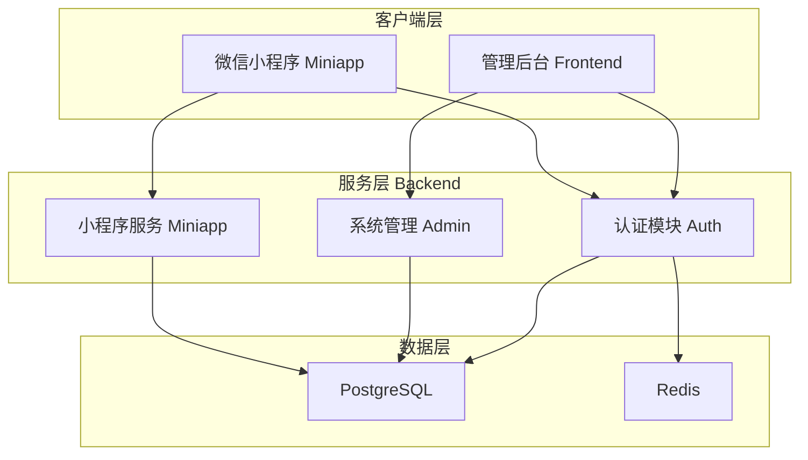
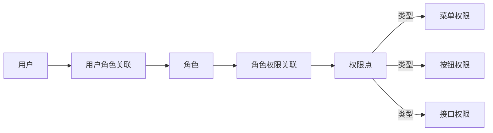
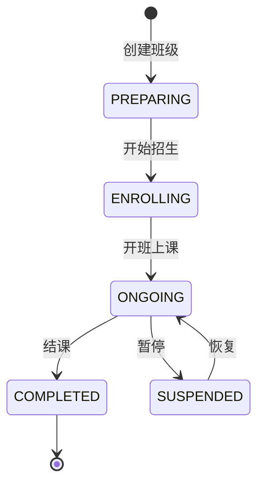
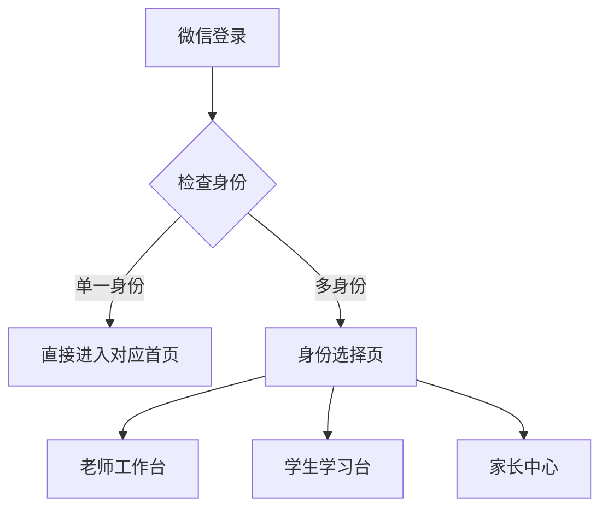
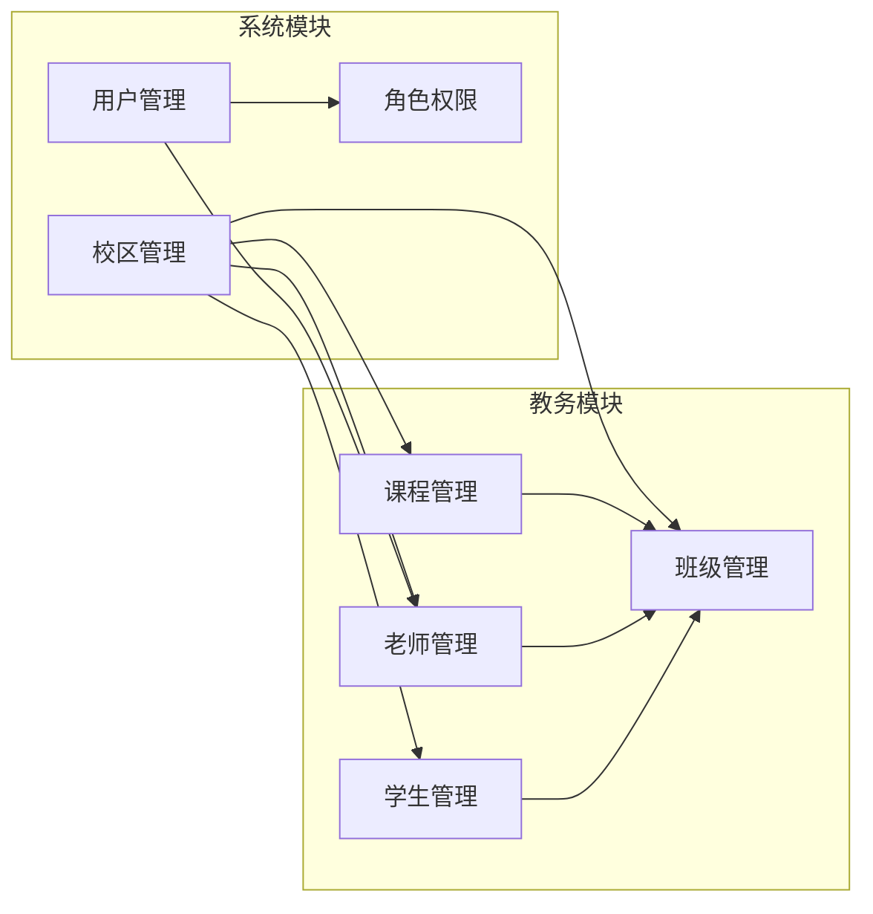
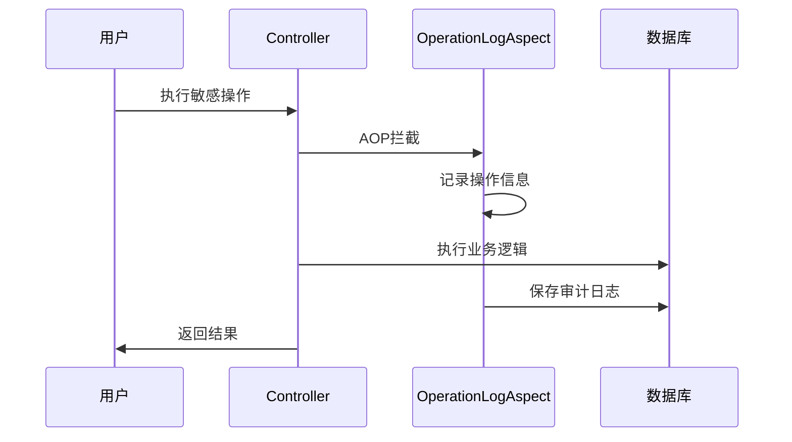

# 功能文档

> 本文档详细介绍小区英语教育管理系统的功能模块、使用场景及模块依赖关系。

## 系统概述

小区英语教育管理系统是一个面向社区英语培训机构的综合管理平台，支持多校区运营，提供教务管理、用户管理、家校互动等功能。系统采用前后端分离架构，包含三个子系统：

- **Backend** - 后端服务（Spring Boot）
- **Frontend** - 管理后台（Vue 3 + Element Plus）
- **Miniapp** - 微信小程序（uni-app）

---

## 模块架构

---

## 功能模块详解

### 一、认证授权模块

#### 1.1 用户认证

| 功能 | 描述 | 使用场景 |
|------|------|----------|
| 账号登录 | 用户名密码登录，返回 JWT Token | 管理后台登录 |
| Token 刷新 | Refresh Token 换取新 Access Token | 保持登录状态 |
| 登出 | 清除 Token，退出系统 | 用户主动退出 |
| 获取用户信息 | 获取当前登录用户详细信息 | 页面初始化、权限校验 |

#### 1.2 微信小程序认证

| 功能 | 描述 | 使用场景 |
|------|------|----------|
| 微信登录 | 通过微信 code 换取 openid 并登录 | 小程序自动登录 |
| 身份选择 | 选择当前操作身份（老师/学生/家长） | 多角色用户切换 |
| 获取个人信息 | 获取当前身份下的详细信息 | 小程序首页展示 |

#### 1.3 权限控制

系统采用 RBAC（基于角色的访问控制）模型：

**权限点类型**：
- `MENU` - 菜单权限，控制页面访问
- `BUTTON` - 按钮权限，控制操作按钮显示
- `API` - 接口权限，控制 API 调用

---

### 二、系统管理模块

#### 2.1 校区管理

| 功能 | 描述 | 使用场景 |
|------|------|----------|
| 校区列表 | 分页查询校区信息 | 校区管理页面 |
| 校区详情 | 查看单个校区详细信息 | 编辑校区前预览 |
| 创建校区 | 新增校区记录 | 开设新校区 |
| 编辑校区 | 修改校区基本信息 | 校区信息变更 |
| 状态变更 | 启用/停用校区 | 校区运营状态管理 |

**校区数据结构**：
- 校区编码、名称、简称
- 联系人、联系电话
- 地址、经纬度坐标
- 营业时间、状态

#### 2.2 用户管理

| 功能 | 描述 | 使用场景 |
|------|------|----------|
| 用户列表 | 分页查询系统用户 | 用户管理页面 |
| 用户详情 | 查看用户详细信息 | 编辑用户前预览 |
| 创建用户 | 新增系统用户账号 | 添加新员工账号 |
| 编辑用户 | 修改用户基本信息 | 用户信息变更 |
| 重置密码 | 重置用户登录密码 | 用户忘记密码 |
| 状态变更 | 启用/停用用户账号 | 账号状态管理 |

**用户类型**：
- `ADMIN` - 管理员
- `TEACHER` - 老师
- `GUARDIAN` - 家长

#### 2.3 角色权限管理

| 功能 | 描述 | 使用场景 |
|------|------|----------|
| 角色列表 | 分页查询角色 | 角色管理页面 |
| 角色详情 | 查看角色及权限配置 | 编辑角色前预览 |
| 创建角色 | 新增角色 | 定义新角色类型 |
| 编辑角色 | 修改角色基本信息 | 角色信息变更 |
| 角色授权 | 配置角色权限点 | 权限分配 |
| 权限树查询 | 获取完整权限树结构 | 权限配置界面 |

---

### 三、教务管理模块

#### 3.1 老师管理

| 功能 | 描述 | 使用场景 |
|------|------|----------|
| 老师列表 | 分页查询老师档案 | 老师管理页面 |
| 老师详情 | 查看老师详细信息 | 编辑老师前预览 |
| 创建老师 | 新增老师档案 | 新老师入职 |
| 编辑老师 | 修改老师基本信息 | 老师信息变更 |
| 状态变更 | 启用/停用老师 | 老师在职状态管理 |

**老师数据结构**：
- 工号、姓名、性别
- 职称、专长领域
- 联系电话、简介
- 入职日期、状态

#### 3.2 课程管理

| 功能 | 描述 | 使用场景 |
|------|------|----------|
| 课程列表 | 分页查询课程信息 | 课程管理页面 |
| 课程详情 | 查看课程详细信息 | 编辑课程前预览 |
| 创建课程 | 新增课程体系 | 开设新课程 |
| 编辑课程 | 修改课程基本信息 | 课程信息变更 |
| 状态变更 | 启用/停用课程 | 课程运营状态 |

**课程数据结构**：
- 课程编码、课程体系
- 课程名称、级别名称
- 适用年龄范围、年级范围
- 总课时、单价、套餐价
- 课程描述、状态

#### 3.3 班级管理

| 功能 | 描述 | 使用场景 |
|------|------|----------|
| 班级列表 | 分页查询班级信息 | 班级管理页面 |
| 班级详情 | 查看班级详细信息 | 编辑班级前预览 |
| 创建班级 | 新增班级 | 开设新班级 |
| 编辑班级 | 修改班级基本信息 | 班级信息变更 |
| 状态变更 | 变更班级状态 | 班级运营状态 |
| 班级学生 | 查询班级学生列表 | 班级学员管理 |

**班级状态流转**：

**班级数据结构**：
- 关联课程、班级编号
- 班级名称、班主任
- 教室、班级微信群二维码
- 开课日期、结课日期
- 最大人数、当前人数
- 状态、备注

#### 3.4 学生管理

| 功能 | 描述 | 使用场景 |
|------|------|----------|
| 学生列表 | 分页查询学生档案 | 学生管理页面 |
| 学生详情 | 查看学生详细信息 | 编辑学生前预览 |
| 创建学生 | 新增学生档案 | 新学员报名 |
| 编辑学生 | 修改学生基本信息 | 学生信息变更 |
| 状态变更 | 变更学生状态 | 学员状态管理 |

**学生数据结构**：
- 学号、姓名、昵称
- 头像、性别、生日
- 年级、学校
- 英语水平、学习目标
| 报名日期、状态 |

---

### 四、小程序功能模块

#### 4.1 身份管理

小程序支持多身份切换，一个用户可能同时具备老师、家长等多重身份：

#### 4.2 老师工作台

| 功能 | 描述 | 使用场景 |
|------|------|----------|
| 课程查看 | 查看今日/本周课程安排 | 课前准备 |
| 考勤管理 | 学生课堂考勤签到 | 上课考勤 |
| 作业发布 | 发布班级作业 | 课后作业 |
| 作业点评 | 查看并点评学生作业 | 作业批改 |

#### 4.3 学生学习台

| 功能 | 描述 | 使用场景 |
|------|------|----------|
| 课程查看 | 查看课程安排 | 课前预习 |
| 作业提交 | 提交作业内容 | 课后作业 |
| 学习资料 | 查看学习资料 | 自主学习 |

#### 4.4 家长中心

| 功能 | 描述 | 使用场景 |
|------|------|----------|
| 孩子管理 | 查看关联孩子信息 | 多子女管理 |
| 课程查看 | 查看孩子课程安排 | 了解学习进度 |
| 作业查看 | 查看孩子作业情况 | 监督学习 |
| 活动报名 | 报名校区活动 | 参加活动 |

---

## 模块依赖关系

**依赖说明**：
- 所有教务数据（老师、课程、班级、学生）都属于特定校区
- 用户账号可关联老师档案
- 班级依赖课程和班主任（老师）
- 学生可加入多个班级

---

## 数据权限控制

系统支持多级数据权限：

| 权限范围 | 描述 | 适用场景 |
|----------|------|----------|
| `SYSTEM` | 系统级，可访问所有校区数据 | 超级管理员 |
| `CAMPUS` | 校区级，仅访问指定校区数据 | 校区管理员、老师 |
| `CLASS` | 班级级，仅访问指定班级数据 | 班主任 |

**数据隔离机制**：
- 通过 `X-Campus-Id` 请求头标识当前操作校区
- 后端通过 `CampusContextHolder` 获取校区上下文
- MyBatis-Plus 自动注入校区过滤条件

---

## 操作审计

系统对敏感操作进行审计日志记录：

**审计内容**：
- 操作模块、操作名称
- 业务类型、业务ID
- 请求方法、请求URI
- 操作IP、User-Agent
- 操作结果、错误信息

---

## 扩展功能（数据库已支持）

以下功能已在数据库层面设计完成，待后续开发：

| 模块 | 功能 | 状态 |
|------|------|------|
| 课表管理 | 班级课表安排、上课记录 | 数据表已创建 |
| 考勤管理 | 学生课堂考勤、课时消耗 | 数据表已创建 |
| 作业系统 | 作业发布、提交、点评、打卡 | 数据表已创建 |
| 课时账户 | 学生课时购买、消耗、退款 | 数据表已创建 |
| 拼班功能 | 拼班发起、成员管理、试听安排 | 数据表已创建 |
| 活动管理 | 校区活动发布、报名 | 数据表已创建 |
| 订单管理 | 课程购买、活动报名订单 | 数据表已创建 |
| 文件管理 | 文件上传、资料管理 | 数据表已创建 |
| 通知系统 | 站内通知、小程序待办 | 数据表已创建 |

---

## 技术特性

### 安全特性

- JWT Token 认证，支持 Access Token 和 Refresh Token
- 密码加密存储（BCrypt）
- 接口权限校验（`@RequirePermission` 注解）
- 操作审计日志
- 请求链路追踪（TraceId）

### 多租户支持

- 校区级数据隔离
- 用户可关联多个校区
- 支持校区切换

### 缓存策略

- Redis 存储 Token 黑名单
- Redis 缓存用户权限信息