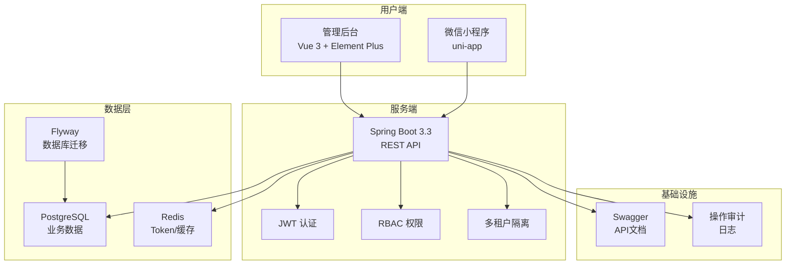

# 小区英语教育管理系统

> 一个面向社区英语培训机构的综合管理平台，支持多校区运营、教务管理、家校互动等功能。

## 项目简介

本项目为社区英语培训机构提供一站式数字化管理解决方案，涵盖：

- **多校区管理** - 支持多校区运营，数据隔离
- **教务管理** - 老师、课程、班级、学生全流程管理
- **权限控制** - RBAC 权限模型，精细化权限管理
- **家校互动** - 微信小程序连接老师、学生、家长

## 系统架构



## 技术栈

### 后端 (Backend)

| 技术 | 版本 | 说明 |
|------|------|------|
| Spring Boot | 3.3.5 | 核心框架 |
| Spring Security | - | 安全认证 |
| MyBatis-Plus | 3.5.7 | ORM 框架 |
| PostgreSQL | - | 主数据库 |
| Redis | - | 缓存/Token存储 |
| Flyway | - | 数据库迁移 |
| JWT | - | Token 认证 |
| SpringDoc | 2.6.0 | API 文档 |
| Lombok | - | 代码简化 |

### 前端 (Frontend)

| 技术 | 版本 | 说明 |
|------|------|------|
| Vue | 3.5 | 前端框架 |
| Vue Router | 4.5 | 路由管理 |
| Pinia | 2.2 | 状态管理 |
| Element Plus | 2.9 | UI 组件库 |
| Axios | 1.7 | HTTP 客户端 |
| TypeScript | 5.7 | 类型支持 |
| Vite | 6.0 | 构建工具 |
| Lucide Icons | - | 图标库 |

### 小程序 (Miniapp)

| 技术 | 版本 | 说明 |
|------|------|------|
| uni-app | 3.0 | 跨平台框架 |
| Vue | 3.5 | 前端框架 |
| Pinia | 2.2 | 状态管理 |
| TypeScript | 5.7 | 类型支持 |

---

## 项目结构

```
edu/
├── backend/                    # 后端服务
│   ├── src/
│   │   ├── main/
│   │   │   ├── java/
│   │   │   │   └── com/community/edu/
│   │   │   │       ├── admin/          # 系统管理模块
│   │   │   │       │   ├── dto/        # 数据传输对象
│   │   │   │       │   ├── *Controller.java    # 控制器
│   │   │   │       │   └── *Service.java       # 服务层
│   │   │   │       ├── auth/           # 认证模块
│   │   │   │       ├── common/         # 公共组件
│   │   │   │       │   ├── audit/      # 操作审计
│   │   │   │       │   ├── context/    # 上下文管理
│   │   │   │       │   ├── exception/  # 异常处理
│   │   │   │       │   ├── response/   # 响应封装
│   │   │   │       │   ├── security/   # 权限注解
│   │   │   │       │   └── trace/      # 链路追踪
│   │   │   │       ├── config/         # 配置类
│   │   │   │       ├── entity/         # 实体类
│   │   │   │       ├── mapper/         # MyBatis Mapper
│   │   │   │       ├── miniapp/        # 小程序服务
│   │   │   │       │   ├── dto/
│   │   │   │       │   └── wechat/     # 微信相关
│   │   │   │       ├── security/       # 安全组件
│   │   │   │       └── service/        # 业务服务
│   │   │   └── resources/
│   │   │       ├── application.yml     # 配置文件
│   │   │       └── db/migration/       # Flyway 迁移脚本
│   │   └── test/
│   ├── pom.xml                 # Maven 配置
│   └── README.md
│
├── frontend/                   # 管理后台
│   ├── src/
│   │   ├── api/                # API 接口
│   │   │   ├── admin.ts        # 管理接口
│   │   │   ├── auth.ts         # 认证接口
│   │   │   └── http.ts         # HTTP 配置
│   │   ├── assets/             # 静态资源
│   │   ├── layouts/            # 布局组件
│   │   │   └ AdminLayout.vue   # 管理后台布局
│   │   ├── router/             # 路由配置
│   │   ├── stores/             # 状态管理
│   │   │   └ auth.ts           # 认证状态
│   │   ├── styles/             # 样式文件
│   │   ├── types/              # 类型定义
│   │   ├── utils/              # 工具函数
│   │   ├── views/              # 页面组件
│   │   │   ├── CampusesView.vue    # 校区管理
│   │   │   ├── UsersView.vue       # 用户管理
│   │   │   ├── RolesView.vue       # 角色管理
│   │   │   ├── TeachersView.vue    # 老师管理
│   │   │   ├── CoursesView.vue     # 课程管理
│   │   │   ├── ClassesView.vue     # 班级管理
│   │   │   ├── StudentsView.vue    # 学生管理
│   │   │   ├── DashboardView.vue   # 工作台
│   │   │   └── LoginView.vue       # 登录页
│   │   ├── App.vue
│   │   ├── main.ts
│   │   └── env.d.ts
│   ├── package.json
│   ├── vite.config.ts
│   └── tsconfig.json
│
├── miniapp/                    # 微信小程序
│   ├── src/
│   │   ├── api/                # API 接口
│   │   ├── pages/              # 页面
│   │   │   ├── login/          # 登录页
│   │   │   ├── identity/       # 身份选择
│   │   │   ├── teacher/        # 老师工作台
│   │   │   ├── student/        # 学生学习台
│   │   │   ├── guardian/       # 家长中心
│   │   │   └── mine/           # 个人中心
│   │   ├── stores/             # 状态管理
│   │   ├── types/              # 类型定义
│   │   ├── utils/              # 工具函数
│   │   ├── pages.json          # 页面配置
│   │   ├── manifest.json       # 应用配置
│   │   └ App.vue
│   │   └ main.ts
│   ├── package.json
│   └── vite.config.ts
│
├── database/                   # 数据库脚本
│   ├── 00_create_database.sql  # 创建数据库
│   ├── 01_schema.sql           # 表结构
│   ├── 02_seed.sql             # 初始数据
│   └── 03_miniapp_auth.sql     # 小程序认证
│
├── FEATURES.md                 # 功能文档
├── API.md                      # 接口文档
└ README.md                     # 项目说明
```

---

## 功能特性

### 系统管理

- ✅ **校区管理** - 多校区运营，校区信息维护
- ✅ **用户管理** - 用户账号创建、编辑、权限分配
- ✅ **角色权限** - RBAC 权限模型，精细化权限控制

### 教务管理

- ✅ **老师管理** - 老师档案、职称、专长管理
- ✅ **课程管理** - 课程体系、定价、适用范围
- ✅ **班级管理** - 班级创建、学生分配、状态流转
- ✅ **学生管理** - 学生档案、学习目标、状态管理

### 小程序功能

- ✅ **微信登录** - 微信授权自动登录
- ✅ **身份切换** - 老师/学生/家长多身份支持
- ✅ **老师工作台** - 课程查看、考勤管理
- ✅ **学生学习台** - 课程查看、作业提交
- ✅ **家长中心** - 孩子管理、学习监督

### 安全特性

- ✅ JWT Token 认证
- ✅ 接口权限校验
- ✅ 操作审计日志
- ✅ 多校区数据隔离

### 扩展功能（待开发）

- 📋 课表管理
- 📋 考勤管理
- 📋 作业系统
- 📋 课时账户
- 📋 拼班功能
- 📋 活动管理
- 📋 订单管理

---

## 快速开始

### 环境要求

| 软件 | 版本要求 |
|------|----------|
| Java | 17+ |
| Maven | 3.6+ |
| Node.js | 18+ |
| PostgreSQL | 14+ |
| Redis | 6+ |

### 安装步骤

#### 1. 克隆项目

```bash
git clone <repository-url>
cd edu
```

#### 2. 数据库配置

```bash
# 创建数据库
psql -U postgres -f database/00_create_database.sql

# 或使用 Flyway 自动迁移（后端启动时自动执行）
```

#### 3. 后端配置

编辑 `backend/src/main/resources/application.yml`：

```yaml
spring:
  datasource:
    url: jdbc:postgresql://localhost:5432/edu_group
    username: postgres
    password: your_password
  data:
    redis:
      host: localhost
      port: 6379
```

#### 4. 启动后端

```bash
cd backend
mvn spring-boot:run
```

后端服务启动在 `http://localhost:18055`

#### 5. 启动前端

```bash
cd frontend
npm install
npm run dev
```

前端服务启动在 `http://localhost:5173`

#### 6. 启动小程序

```bash
cd miniapp
npm install
npm run dev:mp-weixin
```

使用微信开发者工具打开 `dist/dev/mp-weixin` 目录。

---

## 配置说明

### 后端配置

| 配置项 | 说明 | 默认值 |
|--------|------|--------|
| server.port | 服务端口 | 18055 |
| spring.datasource.url | 数据库连接 | jdbc:postgresql://localhost:5432/edu_group |
| spring.data.redis.host | Redis 地址 | localhost |
| spring.data.redis.port | Redis 端口 | 16379 |
| app.security.jwt-secret | JWT 密钥 | 需生产环境修改 |
| app.security.access-token-ttl | Access Token 有效期 | 2h |
| app.security.refresh-token-ttl | Refresh Token 有效期 | 7d |
| app.wechat.miniapp.app-id | 微信小程序 AppID | 需配置 |
| app.wechat.miniapp.app-secret | 微信小程序 AppSecret | 需配置 |

### 前端配置

前端通过 Vite 代理连接后端，配置见 `vite.config.ts`：

```typescript
server: {
  proxy: {
    '/api': {
      target: 'http://localhost:18055',
      changeOrigin: true,
    },
  },
}
```

---

## 默认账号

系统初始化后提供以下测试账号：

| 用户名 | 密码 | 角色 | 说明 |
|--------|------|------|------|
| admin | admin123 | 超级管理员 | 系统最高权限 |
| campus_admin | campus123 | 校区管理员 | 校区运营权限 |

---

## API 文档

- **Swagger UI**: http://localhost:18055/swagger-ui.html
- **详细接口文档**: [API.md](./API.md)

---

## 功能文档

详细功能说明请参阅 [FEATURES.md](./FEATURES.md)

---

## 开发指南

### 后端开发

```bash
# 编译
mvn compile

# 运行测试
mvn test

# 打包
mvn package -DskipTests

# 运行
java -jar target/edu-backend-0.0.1-SNAPSHOT.jar
```

### 前端开发

```bash
# 开发模式
npm run dev

# 类型检查
npm run typecheck

# 构建生产版本
npm run build

# 预览生产版本
npm run preview
```

### 小程序开发

```bash
# 开发模式
npm run dev:mp-weixin

# 构建生产版本
npm run build:mp-weixin

# 类型检查
npm run typecheck
```

---

## 数据库迁移

项目使用 Flyway 进行数据库版本管理：

| 版本 | 文件 | 说明 |
|------|------|------|
| V1 | V1__schema.sql | 表结构创建 |
| V2 | V2__seed.sql | 初始数据 |
| V3 | V3__miniapp_auth.sql | 小程序认证扩展 |

---

## 许可证

MIT License

---

## 贡献指南

欢迎提交 Issue 和 Pull Request。

1. Fork 本仓库
2. 创建特性分支 (`git checkout -b feature/amazing-feature`)
3. 提交更改 (`git commit -m 'Add amazing feature'`)
4. 推送分支 (`git push origin feature/amazing-feature`)
5. 创建 Pull Request