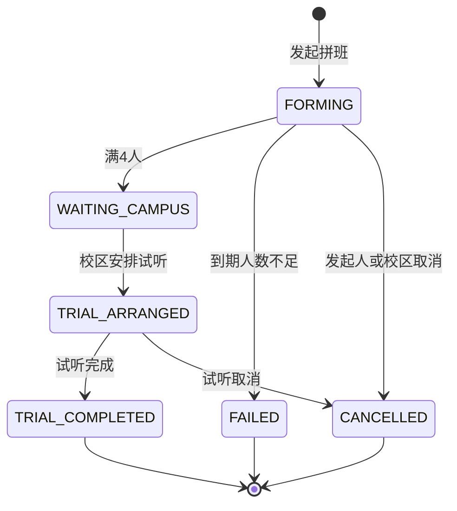

# 学生端小程序详细功能规划

> 面向小区英语教育管理系统的学生/家长小程序端规划。本文基于当前代码与数据库设计完善需求，用于产品评审、UI 设计、接口拆分和迭代排期。

## 1. 规划结论

学生端应从“学生学习台”升级为“学生/家长学习服务入口”。实际使用者大概率是家长，也可能是具备独立手机的学生，因此建议统一按“当前登录用户 + 当前孩子/学生身份”设计，支持多孩子切换。

核心目标：

- 让家长打开首页即可知道：还剩多少课时、下一节课何时上、有哪些待办。
- 让学习动作在线闭环：查作业、交作业、看点评、看资料、查课表。
- 让运营动作在线闭环：活动报名支付、拼班发起分享、试听安排与反馈。
- 让校区服务透明：课消记录、报名记录、拼班进度、联系客服都可追踪。

建议小程序底部导航采用 5 个主入口：

| 入口 | 定位 | 对应需求 |
| --- | --- | --- |
| 首页 | 今日看板与关键提醒 | 登录、剩余课时、最近课程、待办、拼班入口 |
| 学习 | 作业与资料库 | 我的作业、资料库 |
| 课程 | 课表、课时、考勤 | 我的课程、课时记录 |
| 活动 | 校区活动与报名 | 活动展示、报名、支付 |
| 我的 | 个人信息与服务记录 | 信息、消费记录、报名、拼班、客服 |

## 2. 用户与身份

### 2.1 目标用户

| 用户 | 主要诉求 | 产品处理 |
| --- | --- | --- |
| 在读学生/家长 | 查课、交作业、看课消、看点评 | 默认进入首页仪表盘，展示当前学生数据 |
| 潜在新生/家长 | 参与拼班、试听、活动 | 可通过分享链接进入，授权手机号后创建潜客或临时成员 |
| 多孩子家长 | 切换不同孩子数据 | 首页顶部提供孩子切换，所有模块按当前孩子过滤 |
| 老师/校区运营 | 处理作业、活动、拼班、反馈 | 通过后台和老师端承接，不在学生端暴露管理入口 |

### 2.2 登录与绑定流程

推荐流程：

1. 用户进入小程序，调用微信登录获取 `loginCode`。
2. 引导用户授权手机号，后端用手机号、openid/unionid 匹配系统账号。
3. 若匹配到学生、家长或老师身份，返回身份列表；单身份直接进入，多身份进入身份选择页。
4. 若手机号未匹配，进入“选择校区/填写孩子信息/输入邀请码”流程，生成潜客或等待校区确认。
5. 若从老师邀请码、班级邀请码、拼班分享进入，优先解析 `inviteCode` 或 `shareCode`，完成绑定后自动加入对应班级或拼班。

必须处理的异常：

- 一个手机号关联多个学生：进入孩子选择页，默认展示最近活跃孩子。
- 一个学生关联多个监护人：允许多个家长查看，但敏感操作如支付、退费、资料下载需要校区配置权限。
- 未授权手机号：允许浏览公开拼班/活动基础信息，但不能报名、支付、提交作业。
- 账号禁用或学生退班：展示原因与联系客服入口，不直接进入业务页。

## 3. 首页仪表盘

首页应承担“今日行动入口”，避免只做功能菜单。

### 3.1 页面结构

| 区块 | 内容 | 建议 |
| --- | --- | --- |
| 欢迎信息 | 学员姓名、头像、年级、所在校区/班级 | 多孩子时支持切换 |
| 核心数据看板 | 总剩余课时、按课程拆分剩余课时、最近一次课消 | 课时不足时突出提醒续费/联系校区 |
| 最近课程 | 下一节课时间、主题、老师、教室/线上链接 | 支持加入日历、查看课前资料 |
| 待办提醒 | 待提交作业、未读点评、活动开始提醒、拼班状态变化 | 只展示 3-5 条，更多进入通知中心 |
| 拼班入口 | “我要拼班”主按钮 + 我的拼班状态卡 | 新老学生均可发起，首页常驻 |
| 快捷入口 | 作业、资料、课表、活动、客服 | 与底部导航互补，不堆满 |

### 3.2 首页数据建议

建议新增聚合接口：

`GET /api/student/dashboard`

返回：

- `studentProfile`：学生姓名、头像、年级、校区、班级。
- `lessonSummary`：总剩余课时、低课时标记、课程维度课时。
- `nextLesson`：下一节课时间、主题、老师、教室、状态。
- `todos`：作业、点评、活动、拼班、通知。
- `activeGroupRequest`：最近一个进行中的拼班单。

这样首页不需要前端并发拼多个接口，且便于后端统一做学生身份与校区隔离。

## 4. 拼班功能

拼班是本需求里最重要的运营闭环，建议作为首页强入口，同时在“我的”里保留历史列表。

### 4.1 业务目标

- 老生可以为新课程发起拼班，邀请同龄同目标孩子。
- 新生可以通过海报或链接一键参与，形成潜客线索。
- 满 4 人后进入校区处理，校区安排试听课。
- 试听后后台写反馈，并推动报名正式班。

### 4.2 发起拼班

发起表单字段：

| 字段 | 必填 | 说明 |
| --- | --- | --- |
| 孩子年龄 | 是 | 支持小数，如 8.5 岁 |
| 年级 | 是 | 如二年级、三年级 |
| 目标体系 | 是 | 如自然拼读、剑桥 KET/PET、校内同步、口语表达 |
| 英语基础 | 是 | 零基础、校内同步、读写薄弱、备考基础等 |
| 希望校区 | 是 | 默认当前校区，也可选择附近校区 |
| 可上课时间 | 是 | 支持多选：周六上午、周日下午等 |
| 备注 | 否 | 期望、特殊情况 |
| 联系手机号 | 是 | 默认授权手机号，可确认或更换 |

规则：

- 默认最低成团人数为 4 人，使用数据库 `grp_rule.min_members`。
- 默认有效期为 14 天，使用 `grp_rule.auto_fail_days`，到期未满员自动失败。
- 发起者自动成为第 1 名成员。
- 同一学生同一目标体系建议限制只能存在一个进行中的拼班。

### 4.3 拼班状态

建议状态机：

页面展示文案：

| 状态 | 学生端展示 | 可操作 |
| --- | --- | --- |
| `FORMING` | 拼班中，已加入 x/4 人 | 邀请好友、查看成员、取消 |
| `WAITING_CAMPUS` | 拼班成功，等待校区安排试听 | 查看成员、联系客服 |
| `TRIAL_ARRANGED` | 试听课已安排 | 查看试听时间、地点、老师、班级群二维码 |
| `TRIAL_COMPLETED` | 试听已完成 | 查看试听反馈、联系报名 |
| `FAILED` | 拼班失败，人数不足或过期 | 重新发起、联系客服 |
| `CANCELLED` | 拼班已取消 | 查看原因、重新发起 |

当前数据库已有 `grp_request.status`、`grp_trial`、`grp_trial_feedback`，可承接以上状态；若不新增枚举表，也应在服务层统一状态常量。

### 4.4 拼班进度页

内容：

- 拼班目标：目标体系、年龄/年级、英语基础、可上课时间。
- 进度条：已加入人数 / 所需人数，剩余有效时间。
- 成员列表：昵称、头像、加入时间；手机号仅后台可见。
- 邀请操作：转发好友/微信群、生成邀请海报、复制口令或链接。
- 校区说明：满员后可先试听，试听后由校区确认正式班。
- 当前状态提示：下一步由谁处理、预计处理时长。

隐私建议：

- 分享页只展示昵称和头像，不展示真实姓名、手机号、学校。
- 新用户参与前必须完成手机号授权或填写联系电话。
- 海报二维码使用 `shareCode`，不要把学生 ID 暴露在路径中。

### 4.5 分享与新用户参与

分享形式：

| 形式 | 场景 | 实现建议 |
| --- | --- | --- |
| 转发好友/微信群 | 最主要入口 | 分享小程序页面路径，携带 `shareCode` |
| 朋友圈 | 扩散获客 | 支持小程序朋友圈分享能力；同时提供海报图片兜底 |
| 邀请海报 | 群、朋友圈、线下转发 | 后端生成带二维码海报，存入 `res_file` 并关联 `grp_request.poster_file_id` |

新用户点击分享后的流程：

1. 进入拼班邀请页，展示目标体系、年龄段、时间偏好和当前进度。
2. 点击“我要参与”。
3. 授权手机号或填写联系方式。
4. 填写孩子昵称、年龄、年级、英语基础，可复用发起单信息。
5. 后端创建 `grp_member`；若系统没有学生档案，可创建潜在学生或仅保留成员线索。
6. 若加入后达到 4 人，更新拼班单为 `WAITING_CAMPUS`，通知后台处理。

### 4.6 后台处理与试听反馈

后台需要承接：

- 拼班列表：按校区、状态、目标体系、发起时间筛选。
- 成员详情：联系方式、孩子信息、参与来源。
- 安排试听：填写试听时间、地点、老师、关联班级、班级微信群二维码。
- 状态通知：试听安排后通知所有成员。
- 试听反馈：后台或老师端为每个成员写反馈、结果、下一步动作。
- 转报名：试听完成后可创建正式学生档案、生成课程订单、加入班级。

## 5. 学习中心

学习中心建议分为两个 Tab：“我的作业”和“资料库”。

### 5.1 我的作业

作业列表字段：

- 作业标题、发布老师、所属班级。
- 截止时间、剩余时间。
- 提交状态：待提交、已提交待点评、已点评、已逾期。
- 作业类型：普通作业、打卡作业。
- 附件提示：文字、图片、音频、视频。

作业详情：

- 作业要求：文字说明、图片、音频、视频、PDF。
- 截止时间、提交规则、是否允许补交/重交。
- 提交区：文字、图片、语音、视频。
- 提交历史：提交时间、提交内容、附件。
- 老师点评：文字点评、语音点评、评分、点评时间。

建议状态：

| 状态 | 说明 |
| --- | --- |
| `TO_SUBMIT` | 未提交且未过期 |
| `OVERDUE` | 未提交且已过期 |
| `SUBMITTED` | 已提交，待老师点评 |
| `COMMENTED` | 老师已点评 |
| `RESUBMIT_REQUIRED` | 老师要求重交 |

当前数据库已有 `edu_homework`、`edu_homework_target`、`edu_homework_attachment`、`edu_homework_submission`、`edu_homework_submission_file`、`edu_homework_comment`、`edu_homework_checkin`，已经支持主要闭环。建议增加“是否允许重交”“最晚补交时间”字段或通过配置处理。

### 5.2 资料库

资料分类：

- 绘本馆
- 真题库
- 语法宝典
- 视频课堂
- 听力音频
- 班级资料

资料能力：

- 按分类、课程体系、班级、必学/选学筛选。
- PDF 在线预览，视频在线播放，音频在线播放。
- 下载开关由后台配置，对应 `res_material.allow_download`。
- 必学资料突出显示，并进入首页待办或学习提醒。
- 资料可由老师推送给特定班级，对应 `res_material.visibility` 和 `res_material_class`。

建议补充：

- 学习记录表：记录资料查看、播放进度、完成状态，便于“必学资料”闭环。
- 收藏功能：家长可收藏常用资料。
- 内容审核：资料发布前需要 `audit_status=APPROVED`。

## 6. 我的课程

### 6.1 课程表

支持两种视图：

- 周视图：适合固定上课节奏，展示本周每天课程。
- 列表视图：适合手机浏览，按时间倒序/正序展示。

课程卡片字段：

- 日期、开始结束时间。
- 班级、课程、课次。
- 本节主题、内容摘要。
- 老师、教室或线上链接。
- 状态：待上课、已完成、调课、取消。

详情页建议展示：

- 本节课主题和课前资料。
- 班级微信群二维码入口。
- 上课地点地图导航。
- 课后作业入口。

### 6.2 课时记录

需要清晰区分“课时账户”和“课消流水”。

课时账户：

- 课程名称。
- 购买课时、赠送课时、已消耗、已退款、冻结课时、剩余课时。
- 低余额提醒阈值。

课消记录：

- 上课时间、课程/班级、课次主题。
- 消耗课时。
- 考勤状态：正常、迟到、请假、缺勤。
- 操作人和确认时间。
- 备注，如请假不扣课时。

当前数据库已有 `edu_lesson_hour_account`、`edu_lesson_hour_record`、`edu_attendance`，能承接该模块。

建议二期能力：

- 请假申请、补课申请。
- 调课通知确认。
- 课时异常申诉。

## 7. 校区活动

### 7.1 活动列表

列表展示：

- 活动封面、标题。
- 时间、地点、费用。
- 已报名人数/名额。
- 活动状态：报名中、已满员、已结束、已取消。
- 是否已报名。

筛选：

- 本校区活动。
- 免费/付费。
- 本周/本月。
- 适龄年级或课程体系。

### 7.2 活动详情与报名

详情页：

- 活动介绍、流程、注意事项。
- 时间、地点、费用、名额。
- 报名对象：当前孩子，支持多孩子选择。
- 退款/取消规则。
- 联系校区。

报名流程：

1. 选择报名学生。
2. 确认费用和报名信息。
3. 免费活动直接报名，付费活动创建订单。
4. 调用微信支付完成支付。
5. 支付成功后创建报名记录，并进入“我的报名”。

当前数据库已有 `ops_activity`、`ops_activity_registration`、`fin_order`、`fin_payment_record`，可承接活动和支付。

## 8. 个人中心

个人中心不只是资料页，应作为“服务记录中心”。

建议结构：

| 区块 | 内容 |
| --- | --- |
| 我的信息 | 姓名、头像、年级、学校、所在校区、所在班级 |
| 学生切换 | 多孩子家长切换当前学生 |
| 课时与消费 | 剩余课时、课消流水、课程购买订单、退款记录 |
| 我的报名 | 活动报名记录、支付状态、取消/退款状态 |
| 我的拼班 | 进行中、已完成、失败的拼班记录 |
| 通知中心 | 未读点评、作业提醒、拼班进度、活动提醒 |
| 联系校区 | 电话、微信、地址、营业时间、在线客服 |
| 设置 | 隐私授权、消息订阅、退出登录 |

建议把“我的拼班”放在个人中心，同时首页只展示最近一个进行中的拼班卡片。

## 9. 通知与提醒

待办提醒建议统一来自 `sys_notification` 和业务实时计算。

通知类型：

- 作业发布提醒。
- 作业截止提醒。
- 老师点评提醒。
- 下一节课提醒。
- 课时不足提醒。
- 活动报名/支付提醒。
- 拼班满员、试听安排、试听反馈提醒。

建议提供：

- 首页待办卡片：只展示未完成动作。
- 通知中心：展示所有通知，支持已读。
- 微信订阅消息：关键节点触发，但要遵循用户授权。

## 10. 数据与接口规划

### 10.1 当前已有数据基础

| 模块 | 已有表 |
| --- | --- |
| 登录与身份 | `sys_user`、`edu_student`、`edu_guardian`、小程序认证扩展 |
| 课表 | `edu_class_schedule` |
| 资料 | `res_file`、`res_category`、`res_material`、`res_material_class` |
| 活动与支付 | `ops_activity`、`ops_activity_registration`、`fin_order`、`fin_payment_record` |
| 课时与考勤 | `edu_lesson_hour_account`、`edu_lesson_hour_record`、`edu_attendance` |
| 作业 | `edu_homework`、`edu_homework_target`、`edu_homework_attachment`、`edu_homework_submission`、`edu_homework_submission_file`、`edu_homework_comment`、`edu_homework_checkin` |
| 拼班 | `grp_rule`、`grp_request`、`grp_member`、`grp_trial`、`grp_trial_feedback` |
| 待办通知 | `sys_notification` |

### 10.2 学生端接口建议

| 接口 | 方法 | 用途 |
| --- | --- | --- |
| `/api/student/dashboard` | GET | 首页聚合看板 |
| `/api/student/homeworks` | GET | 作业列表 |
| `/api/student/homeworks/{id}` | GET | 作业详情 |
| `/api/student/homeworks/{id}/submit` | POST | 提交/重交作业 |
| `/api/student/materials` | GET | 资料列表 |
| `/api/student/materials/{id}` | GET | 资料详情与预览地址 |
| `/api/student/schedules` | GET | 周课表/列表课表 |
| `/api/student/lesson-hour-accounts` | GET | 课时账户 |
| `/api/student/lesson-hour-records` | GET | 课时流水 |
| `/api/student/activities` | GET | 活动列表 |
| `/api/student/activities/{id}` | GET | 活动详情 |
| `/api/student/activities/{id}/join` | POST | 活动报名 |
| `/api/student/orders/{id}/pay` | POST | 创建微信支付参数 |
| `/api/student/group-requests` | GET | 我的拼班列表 |
| `/api/student/group-requests` | POST | 发起拼班 |
| `/api/student/group-requests/{id}` | GET | 拼班详情 |
| `/api/student/group-requests/{id}/poster` | POST | 生成邀请海报 |
| `/api/student/group-requests/by-share-code/{shareCode}` | GET | 分享页详情 |
| `/api/student/group-requests/{id}/join` | POST | 参与拼班 |
| `/api/student/notifications` | GET | 通知列表 |
| `/api/student/notifications/{id}/read` | POST | 标记已读 |
| `/api/files/upload` | POST | 作业、资料、海报等文件上传 |

### 10.3 后台接口/页面依赖

学生端上线前，后台至少要补齐：

- 作业发布、作业点评、提交附件查看。
- 资料上传、分类、审核、发布、班级可见配置。
- 课表维护、考勤确认、课消确认。
- 活动发布、名额管理、报名记录、订单处理。
- 拼班管理、试听安排、试听反馈、转报名。
- 文件上传与访问控制。
- 微信支付回调处理与订单状态同步。

## 11. 页面清单

建议页面：

| 页面 | 路径建议 | 说明 |
| --- | --- | --- |
| 首页 | `pages/student/home` | 学生端仪表盘 |
| 作业列表 | `pages/student/homework/list` | 学习中心作业 Tab |
| 作业详情 | `pages/student/homework/detail` | 要求、提交、点评 |
| 资料库 | `pages/student/material/list` | 分类与筛选 |
| 资料详情 | `pages/student/material/detail` | 预览、下载、播放 |
| 课程表 | `pages/student/course/schedule` | 周视图/列表 |
| 课时记录 | `pages/student/course/hours` | 账户与流水 |
| 活动列表 | `pages/student/activity/list` | 校区活动 |
| 活动详情 | `pages/student/activity/detail` | 报名与支付 |
| 拼班发起 | `pages/student/group/create` | 发起表单 |
| 拼班详情 | `pages/student/group/detail` | 进度、成员、试听 |
| 拼班分享页 | `pages/student/group/share` | 新用户加入 |
| 我的 | `pages/mine/index` | 个人中心 |
| 通知中心 | `pages/mine/notifications` | 待办与消息 |

## 12. 迭代优先级

### P0：首版必须完成

- 登录、手机号绑定、身份选择、孩子切换。
- 首页看板：剩余课时、最近课程、待办提醒。
- 拼班：发起、进度、转发、成员加入、后台安排试听、学生端查看试听信息。
- 作业：列表、详情、文字/图片/语音提交、查看点评。
- 课程：课表列表、课时账户、课消记录。
- 我的：基础信息、联系客服。

### P1：增强体验

- 资料库：分类、预览、下载开关、必学/选学。
- 活动：报名、支付、我的报名。
- 通知中心与订阅消息。
- 拼班海报生成、朋友圈分享兜底海报。
- 试听反馈展示和转报名入口。

### P2：运营增长与精细化

- 学习资料完成度、收藏、观看进度。
- 请假/补课/调课确认。
- 活动候补、退款流程。
- 课时不足自动提醒与续费意向收集。
- 拼班智能推荐相似目标学生。

## 13. 验收标准

上线前按以下标准验收：

- 用户可以通过微信登录和手机号授权完成身份绑定；新用户通过拼班分享进入能参与拼班。
- 首页能准确展示当前学生剩余课时、下一节课和待办。
- 作业从发布到提交到点评形成闭环，支持至少文字、图片、语音三种提交。
- 资料库能按班级权限展示资料，并正确控制下载。
- 课程表和课时记录与考勤、课消数据一致。
- 活动能展示、报名、支付，并能在个人中心查看记录。
- 拼班从发起、分享、满员、后台安排试听、查看试听信息、试听反馈形成闭环。
- 所有学生端接口按当前学生和校区隔离数据，不能越权访问其他学生。
- 文件、手机号、学生信息、分享海报均符合隐私和内容安全要求。

## 14. 技术与平台注意事项

- 微信手机号授权、朋友圈分享、微信支付、订阅消息都属于平台开放能力，上线前需要用真实小程序 AppID、商户号和官方文档重新核验。
- 朋友圈分享建议不要作为唯一邀请方式，应同时支持好友/微信群转发和海报二维码。
- 文件上传需要限制大小、类型和访问权限，尤其是学生语音、视频、作业图片。
- 作业、试听反馈、活动报名涉及未成年人信息，后台应记录操作审计并控制角色权限。
- 付费活动必须处理支付回调、重复支付、取消报名、退款和名额并发。

参考微信官方能力文档：

- [手机号快速验证组件](https://developers.weixin.qq.com/miniprogram/dev/framework/open-ability/getPhoneNumber.html)
- [转发能力](https://developers.weixin.qq.com/miniprogram/dev/framework/open-ability/share.html)
- [转发朋友圈](https://developers.weixin.qq.com/miniprogram/dev/framework/open-ability/share-timeline.html)
- [小程序支付 API](https://developers.weixin.qq.com/miniprogram/dev/api/payment/wx.requestPayment.html)
